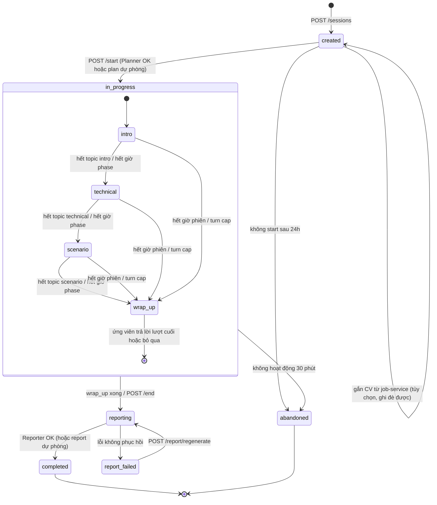

# 4. Orchestrator — state machine

> Thuộc bộ [AI Service design doc](README.md). Liên quan: §5 (policy adapt), §7 (API), §9 (timeout).

## 4.1 Orchestrator nằm ở đâu

Orchestrator là **code Python thuần trong ai-service**, chia làm hai phần:

| Phần | Bản chất | Test |
|---|---|---|
| `transition(state, evaluation, elapsed_seconds) → (new_state, decision)` | **Hàm thuần**, không I/O, không LLM | Unit test 100% nhánh, không cần mạng |
| `TurnRunner` | Gọi agent theo thứ tự, retry, fallback, phát SSE | Integration test với fake LLM client + eval thật (§10) |

**Vì sao đặt trong ai-service mà không phải interview-service:**

- Một lượt chỉ cần **1 request** interview-service → ai-service (Evaluator → policy → Interviewer chạy liền trong
  một process). Đặt ở NestJS thì mỗi lượt cần 2 lượt gọi qua mạng và logic AI bị chia hai ngôn ngữ.
- Vẫn **stateless**: state đi vào cùng request và đi ra ở event `done`; interview-service lưu. ai-service
  restart giữa phiên không mất gì (ADR-004, constitution IV).

**Phân vai với interview-service:**

| interview-service (NestJS) | ai-service (FastAPI) |
|---|---|
| Lưu session, turns, `candidate_state`, plan, report | Không lưu gì về phiên |
| Đồng hồ phiên: tính `elapsed_seconds` từ `started_at` (giờ server) | Dùng `elapsed_seconds` để ra quyết định thời gian |
| Khóa phiên (Redis lock), chống gửi trùng, optimistic lock `state_version` | Kiểm `state.schema_version`, trả lỗi nếu state hỏng |
| Trạng thái phiên (`status`) cho client | Trạng thái phase/topic (`state.phase`) |
| Relay SSE, lưu câu hỏi khi stream xong | Phát SSE |
| Job đánh dấu `abandoned` | — |

## 4.2 Hai tầng trạng thái

**Tầng phiên** (cột `interview_sessions.status`, interview-service quản lý) và **tầng phase** (field
`candidate_state.phase`, orchestrator quản lý). Enum `InterviewSessionStatus` hiện có (`in_progress`,
`completed`, `abandoned`) cần **thêm** `created`, `reporting`, `report_failed`.



`abandoned` sau 30 phút không hoạt động: nếu đã có ≥ 4 lượt được chấm, interview-service vẫn có thể gọi
`/api/finalize` để tạo report với `end_reason = "abandoned"` (độ tin cậy thấp). Dưới 4 lượt thì không tạo report.

## 4.3 Cấu hình phase theo level

Mặc định 30 phút. `durationMinutes` khác 30 thì thời lượng mỗi phase nhân theo tỉ lệ, số topic giữ nguyên
(15 phút: bỏ 1 topic technical).

| Phase | Nội dung | Fresher | Junior | Middle | Senior |
|---|---|---|---|---|---|
| `intro` | Giới thiệu & dự án từ CV | 1 topic · 4' | 1 · 4' | 1 · 5' | 1 · 5' |
| `technical` | Kiến thức chuyên môn | 4 topic · 17' | 4 · 16' | 3 · 14' | 3 · 12' |
| `scenario` | Tình huống / system design | 1 · 7' | 1 · 8' | 1 · 9' | 1 · 11' |
| `wrap_up` | Kết thúc | 0 · 2' | 0 · 2' | 0 · 2' | 0 · 2' |
| **Tổng** | | **6 topic** | **6** | **5** | **5** |

Nội dung phase `scenario` theo level:

| Level | Dạng tình huống | Ví dụ |
|---|---|---|
| Fresher | Debug / bài toán nhỏ | "API trả 500 khi tạo user trùng email, bạn tìm nguyên nhân thế nào?" |
| Junior | Thiết kế API + schema nhỏ | "Thiết kế API và bảng cho chức năng đặt hàng" |
| Middle | Thiết kế feature có concurrency / caching, nêu trade-off | "Chống bán vượt tồn kho khi flash sale" |
| Senior | System design: scale, consistency, failure modes | "Thiết kế hệ thống thông báo 10 triệu user" |

### Giới hạn mỗi topic

| Giới hạn | Fresher | Junior | Middle | Senior |
|---|---|---|---|---|
| Follow-up tối đa / topic (không tính câu chính) | 2 | 2 | 3 | 3 |
| Follow-up tối đa cho topic `scenario` | 3 | 3 | 4 | 4 |
| Gợi ý (`hint`) tối đa / topic | 1 | 1 | 1 | 1 |
| Hỏi lại (`clarify`) tối đa / topic | 1 | 1 | 1 | 1 |
| Thời gian tối đa / topic | budget phase ÷ số topic × 1.5 | | | |
| Tổng lượt tối đa / phiên (turn cap) | 24 | 24 | 24 | 24 |

`hint` và `clarify` **tính vào** số follow-up, để một topic không kéo dài quá `1 + max_follow_up` lượt.

## 4.4 Điều kiện chuyển trạng thái

Kiểm theo **thứ tự ưu tiên** dưới đây sau mỗi lượt (trong `transition()`), điều kiện đầu tiên khớp thắng.

| Ưu tiên | Điều kiện | Kết quả |
|---|---|---|
| 1 | Ứng viên gọi `POST /end` | Bỏ qua wrap_up → `reporting` (`end_reason = "candidate_ended"`) |
| 2 | `elapsed ≥ duration + 3'` (quá hạn cứng) | `end` ngay, không hỏi thêm → `reporting` (`end_reason = "time_hard_limit"`) |
| 3 | `elapsed ≥ duration` **hoặc** `turn_count ≥ 24` | Sang `wrap_up` (`end_reason = "time_up"` / `"turn_cap"`) |
| 4 | Phase hiện tại hết topic **hoặc** `phase_elapsed ≥ phase_budget + 1'` | Sang phase kế tiếp, `action = ask_main` cho topic đầu của phase mới |
| 5 | Topic hiện tại đạt điều kiện đóng (bảng dưới) | Topic kế tiếp trong phase, `action = ask_main` |
| 6 | Còn lại | Policy §5 chọn `follow_up` / `hint` / `clarify` trong topic hiện tại, hoặc `next_topic` |

**Điều kiện đóng topic** (bất kỳ):

- Số follow-up đã dùng = giới hạn.
- Hai lượt liên tiếp `dont_know` trong cùng topic.
- Thời gian topic vượt `budget_topic × 1.5`.

Ngoài ra policy ở ưu tiên 6 (§5.4) cũng có thể trả `next_topic` (trả lời tốt đủ, hoặc yếu sau khi đã gợi ý); khi đó orchestrator đóng topic và xử lý giống ưu tiên 5.

**Mượn thời gian:** phase xong sớm thì thời gian dư cộng vào phase sau. Phase cuối (`scenario`) xong sớm thì
vào `wrap_up` sớm; **không** thêm topic ngoài plan (buổi thật cũng có khi kết thúc sớm).

**Wrap-up:** 1 lượt Interviewer (`action = wrap_up`). Ứng viên có thể trả lời (bổ sung / hỏi lại) hoặc bấm kết
thúc. Câu trả lời wrap-up **không chấm điểm**, được lưu vào transcript; Interviewer **không trả lời tiếp**
(trả lời các câu hỏi kiểu "công ty dùng stack gì" không có ý nghĩa trong luyện tập). Sau đó → `reporting`.

## 4.5 Một lượt xử lý (`/api/next-turn`)

```python
async def run_turn(req: NextTurnRequest) -> AsyncIterator[SseEvent]:
    state = validate_state(req.state)                     # schema_version, phase hợp lệ
    topic = state.active_topic(req.plan)

    # 1. Evaluator (không stream). Có retry + repair + fallback, xem 4.6.
    if state.phase == "wrap_up":
        evaluation = None                                 # wrap-up không chấm
    elif quick_dont_know(req.answer):                     # TOÀN BỘ câu trả lời chỉ là cụm "không biết" / "em chưa học" / "pass" (≤ 6 từ)
        evaluation = Evaluation.dont_know()               # bỏ qua LLM, tiết kiệm ~2s
    else:
        evaluation = await evaluator.run(build_eval_input(req, state, topic))
        evaluation = post_check(evaluation, req.answer, topic)   # quote, cap band

    # 2. Cập nhật state + chọn hành động: HÀM THUẦN, không LLM.
    state, decision = transition(state, req.plan, evaluation, req.elapsed_seconds)

    # 3. Metadata chốt TRƯỚC khi stream: client biết phase/topic ngay.
    yield SseEvent("meta", decision.public_meta())

    if decision.action == "end":
        yield SseEvent("done", build_done(None, state, evaluation, decision))
        return

    # 4. Interviewer stream. Lỗi trước token đầu → fallback backup_question.
    question = ""
    async for chunk in interviewer.stream(build_iv_input(req, state, decision)):
        question += chunk
        yield SseEvent("token", {"t": chunk})

    yield SseEvent("done", build_done(question, state, evaluation, decision))
```

`/api/start` giống vậy nhưng bước 1 là Planner (+ RAG cho từng topic), không có Evaluator, action luôn là
`ask_main` topic đầu.

## 4.6 Xử lý lỗi và retry

### Gọi LLM: chính sách chung

1. **Structured outputs** (`response_format = {"type": "json_schema", "strict": true}`) cho mọi agent trả JSON.
   Với OpenAI models qua OpenRouter, schema được ràng buộc ngay khi sinh nên lỗi format hiếm. Provider / model
   không hỗ trợ: fallback `{"type": "json_object"}` + Pydantic validate + repair retry. Cờ
   `LLM_STRUCTURED_OUTPUTS=true|false` trong env.
2. **Retry lỗi tạm thời** (timeout, HTTP 429, 5xx, lỗi mạng): tối đa **2 lần**, backoff `0.5s → 1.5s` + jitter,
   tôn trọng `Retry-After`. Không retry lỗi 400/401/403 (cấu hình sai, retry vô ích).
3. **Ngân sách thời gian mỗi lượt:** tổng retry của Evaluator ≤ 10 s; hết ngân sách thì fallback, không retry
   tiếp. Ứng viên chờ 20 s là phiên phỏng vấn đã hỏng trải nghiệm.
4. **Repair retry** (lỗi format / ngữ nghĩa): 1 lần, gửi lại cùng prompt + message ngắn:
   *"Output trước không hợp lệ: `scores.completeness` phải là số nguyên 0–4. Trả lại JSON đúng schema."*
   `temperature = 0`.
5. `finish_reason = "length"` (output bị cắt): retry 1 lần với `max_tokens × 1.5`.

### Bảng xử lý theo loại lỗi

| Lỗi | Phát hiện | Xử lý | Ảnh hưởng tới ứng viên |
|---|---|---|---|
| Timeout / 429 / 5xx | Exception từ SDK | Retry 2 lần (chính sách trên) | Chậm thêm vài giây |
| JSON không parse được / sai schema | `ValidationError` | Repair retry 1 lần | Chậm ~1–2 s |
| Evaluator: quote không có trong câu trả lời | Hậu kiểm fuzzy match | Xóa evidence + covered_point tương ứng; > 50% evidence sai → repair retry | Không |
| Evaluator: mâu thuẫn nội tại (`dont_know` mà band > 0; band ngoài 0–4) | Validator | Code sửa theo luật (`dont_know` → band 0) | Không |
| **Evaluator thất bại hẳn** | Hết retry / ngân sách | `Evaluation.degraded()`: `answer_type = "unknown"`, không có band. Policy coi như `ok` không có `missing_points` → `next_topic` nếu đã ≥ 1 follow-up, ngược lại `follow_up` theo key point chưa hỏi. Lượt này **loại khỏi tính điểm**, report ghi chú | Không nhận ra |
| **Interviewer lỗi trước token đầu** | Exception / không có token trong 5 s | Retry 1 lần; vẫn lỗi → dùng câu `backup_question` của topic (action `ask_main`) hoặc câu từ `question_bank` theo category + difficulty. Gửi nguyên câu trong 1 event `token`, `question_source = "fallback"` | Câu hỏi kém "dính" ngữ cảnh hơn |
| **Interviewer lỗi giữa stream** | Exception sau khi đã gửi token | Gửi event `replace` chứa câu fallback đầy đủ; client thay toàn bộ nội dung câu hỏi | Thấy câu hỏi đổi |
| Planner lỗi / plan không hợp lệ sau repair | Hết retry / validator | **Plan dự phòng bằng code**: chọn ngẫu nhiên có trọng số các topic catalog theo level, intro generic | Plan kém cá nhân hóa |
| CV Parser lỗi | Hết retry | Session tiếp tục không CV, `cvStatus = "failed"` | Thông báo "Không đọc được CV, buổi phỏng vấn sẽ không dựa trên CV" |
| Reporter lỗi | Hết retry (timeout 60 s) | Report **chỉ có điểm** (code) + nhận xét mẫu theo template, `report.status = "partial"`; ứng viên có thể bấm tạo lại | Báo cáo ít nhận xét |
| State không hợp lệ (`schema_version` lạ, phase sai) | Pydantic | 422 `invalid_state`; interview-service log lỗi, không tự sửa | Lỗi hiển thị, phiên dừng |
| Gửi trùng câu trả lời / 2 tab cùng lúc | interview-service: Redis lock `interview:lock:{sessionId}` (TTL 60 s) + `turnNumber` mong đợi | Request trùng `turnNumber` đã xử lý → trả lại câu hỏi đã lưu; đang xử lý → 409 `TURN_CONFLICT` | Không hỏi trùng |
| Client mất kết nối giữa stream | interview-service phát hiện socket đóng | interview-service **vẫn đọc hết stream** từ ai-service và lưu câu hỏi + state; client vào lại gọi `GET /sessions/{id}` để lấy câu hỏi hiện tại | Không mất lượt |
| ai-service sập hẳn | Health check / connection refused | `AI_SERVICE_ERROR` (503), session giữ nguyên, client cho phép gửi lại câu trả lời | Thử lại sau |

Mọi fallback được đánh dấu trong `ai_meta.fallbacks` của lượt để đo **tỉ lệ fallback** (§10, mục tiêu < 2%).
Đây là cơ chế "retry giới hạn + fallback" constitution IV yêu cầu; mock client vẫn giữ cho môi trường dev.
