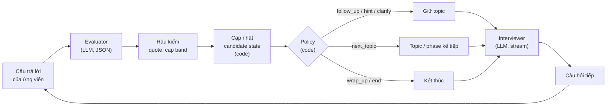

# 5. Vòng lặp adapt & candidate state

> Thuộc bộ [AI Service design doc](README.md). Liên quan: §4 (điều kiện chuyển), §6 (rubric, quy đổi điểm).

## 5.1 Vòng lặp



LLM chỉ xuất hiện ở hai ô: **Evaluator** (đánh giá) và **Interviewer** (diễn đạt). Mọi thứ ở giữa là code
deterministic, cùng input luôn ra cùng quyết định.

## 5.2 Candidate state

JSON do ai-service trả trong event `done`, interview-service lưu ở `interview_sessions.candidate_state` và gửi lại
nguyên văn ở lượt sau. Kích thước điển hình 2–4 KB.

```jsonc
{
  "schema_version": 1,
  "phase": "technical",                        // intro|technical|scenario|wrap_up|done
  "phase_started_at_s": 260,                   // giây kể từ đầu phiên
  "phase_budget_s": 960,                       // đã cộng thời gian mượn từ phase trước
  "topic_index": 1,                            // vị trí trong phase hiện tại
  "active_topic_id": "t3",
  "topic_started_at_s": 610,
  "current_difficulty": 3,                     // 1–5, kẹp trong [min, max] của level
  "difficulty_bounds": { "min": 1, "max": 4 },
  "momentum": 1,                               // -1|0|+1: kết quả topic trước, ảnh hưởng độ khó topic sau
  "counters": {                                // của topic hiện tại, reset khi đổi topic
    "follow_ups": 1,                           // gồm cả hint và clarify
    "hints": 0,
    "clarifies": 0,
    "consecutive_dont_know": 0
  },
  "turn_count": 7,
  "evaluated_turns": 6,
  "topics": [                                  // tóm tắt từng topic đã/đang hỏi
    { "id": "t1", "status": "done", "score_band": 3.2, "hint_used": false, "turns": [1, 2, 3] },
    { "id": "t2", "status": "done", "score_band": 1.6, "hint_used": true,  "turns": [4, 5] },
    { "id": "t3", "status": "active", "score_band": null, "hint_used": false, "turns": [6, 7] }
  ],
  "strengths": [                               // ≤ 10, dedupe theo tag
    { "tag": "rest-api-design", "turns": [2, 3] }
  ],
  "gaps": [                                    // ≤ 10, dedupe theo tag
    { "tag": "spring-proxy-self-invocation", "turns": [4, 5] }
  ],
  "asked_questions": [                         // ≤ 30 câu gần nhất, đã chuẩn hóa, để chống lặp
    "kể về dự án order service và vai trò của bạn"
  ],
  "end_reason": null                           // candidate_ended|time_up|time_hard_limit|turn_cap|plan_complete|abandoned
}
```

Không lưu điểm từng lượt trong state (đã có ở `interview_turns.evaluation`); state chỉ giữ thứ policy cần.

## 5.3 Luật cập nhật state (code)

Sau mỗi `Evaluation` hợp lệ (không degraded):

1. **Điểm lượt** (thang band 0–4):
   `turn_score = 0.40·technical_accuracy + 0.25·completeness + 0.25·extensibility + 0.10·relevance`.
   Relevance trọng số thấp vì hầu hết câu trả lời đều "đúng trọng tâm", dễ thổi phồng điểm.
2. **Phân loại lượt:** `strong` nếu `turn_score ≥ 3.0`; `ok` nếu `1.75 ≤ turn_score < 3.0`; `weak` nếu `< 1.75`.
   `answer_type` ∈ {`dont_know`, `off_topic`, `asks_clarification`, `manipulation`} được xử lý riêng trước.
3. **Strengths:** thêm `strength_tags` khi lượt `strong` **và** `technical_accuracy ≥ 3`.
4. **Gaps:** thêm `gap_tags` khi lượt `weak`, hoặc có `misconceptions`, hoặc `dont_know` (tag = slug topic).
   Một tag đã ở `strengths` mà sau đó lộ gap → chuyển sang `gaps` (bằng chứng mới hơn thắng).
5. **Counters:** `follow_ups += 1` nếu lượt vừa rồi không phải `ask_main`; `hints`/`clarifies` tăng theo action
   vừa thực hiện; `consecutive_dont_know` tăng hoặc reset.
6. **`asked_questions`:** thêm câu hỏi vừa hỏi (lowercase, bỏ dấu câu), giữ 30 câu gần nhất.
7. **Đóng topic:** `score_band` = trung bình `turn_score` các lượt được chấm của topic; `hint_used` nếu có hint;
   `momentum = +1` nếu `score_band ≥ 3.0`, `-1` nếu `< 1.75`, ngược lại `0`.

## 5.4 Policy chọn hành động tiếp

Chạy sau khi các điều kiện ưu tiên 1–5 ở §4.4 (hết giờ, hết phase, đóng topic) không khớp. Đọc từ trên
xuống, luật đầu tiên khớp thắng. `F` = follow-up còn lại của topic (`max_follow_up − counters.follow_ups`).

| # | Điều kiện | Action | Độ khó | `focus` cho Interviewer |
|---|---|---|---|---|
| 1 | `manipulation` | `follow_up` (nếu `F > 0`) hoặc `next_topic` | giữ | Câu hỏi gốc, diễn đạt lại; ghi nhận như lượt `weak` |
| 2 | `off_topic` hoặc `asks_clarification`, chưa clarify | `clarify` | giữ | Câu hỏi vừa rồi, rõ hơn |
| 3 | `off_topic` / `asks_clarification`, đã clarify | `next_topic` | giữ | — |
| 4 | `dont_know`, chưa hint, `F > 0` | `hint` | `−1` | `missing_points[0]` hoặc key point đầu chưa đạt |
| 5 | `dont_know`, đã hint hoặc `F = 0` | `next_topic` | topic sau `−1` | — |
| 6 | `weak`, chưa hint, `F > 0` | `hint` | `−1` | `follow_up_focus` |
| 7 | `weak`, đã hint hoặc `F = 0` | `next_topic` | topic sau `−1` | — |
| 8 | `ok`, `F > 0`, có `missing_points` | `follow_up` | giữ | `missing_points[0]` |
| 9 | `ok`, còn lại | `next_topic` | giữ | — |
| 10 | `strong`, `F > 0` | `follow_up` | `+1` | `follow_up_focus` (trade-off, internals, edge case) |
| 11 | `strong`, `F = 0` | `next_topic` | topic sau `+1` | — |

- Độ khó luôn kẹp trong `difficulty_bounds`.
- **Độ khó khởi đầu topic mới** = `clamp(plan.start_difficulty + momentum)`: ứng viên làm tốt topic trước thì topic
  sau mở ở mức khó hơn plan một bậc.
- `next_topic` khi phase hết topic thì orchestrator chuyển phase (§4.4), Interviewer nhận `transition.phase_changed = true`.
- Evaluation `degraded`: xử lý như `ok` không có `missing_points`, nhưng nếu `follow_ups = 0` thì `follow_up` theo
  key point đầu tiên chưa được hỏi (tránh đóng topic chỉ sau 1 câu vì lỗi kỹ thuật).

### Map sang `agent_decision` hiện có

Cột `interview_turns.agent_decision` (`deepen | switch_topic | keep_difficulty`) giữ để tương thích FE/BE cũ.
Cột mới `action` lưu giá trị đầy đủ.

| `action` (mới) | Thay đổi độ khó | `agent_decision` (cũ) |
|---|---|---|
| `follow_up` | `+1` hoặc giữ | `deepen` |
| `hint` | `−1` | `keep_difficulty` |
| `clarify` | giữ | `keep_difficulty` |
| `ask_main` (topic / phase mới) | bất kỳ | `switch_topic` |
| `wrap_up`, `end` | — | `switch_topic` |

Đây là **thay đổi contract** (thêm enum `action`), cần cập nhật `api-contracts.md` và `data-model.md` (README,
câu hỏi 2).

## 5.5 Ví dụ trace: Junior, Java Backend, topic "Spring @Transactional"

Giới hạn Junior: 2 follow-up, 1 hint. Topic mở ở độ khó 2 (plan) + momentum `+1` (topic trước tốt) = **3**.

| Lượt | Action → câu hỏi (tóm tắt) | Câu trả lời (tóm tắt) | Band (acc/comp/ext/rel) | `turn_score` | Phân loại | Quyết định tiếp |
|---|---|---|---|---|---|---|
| 4 | `ask_main` d3: "Ghi 2 bảng trong 1 method, lỗi giữa chừng thì sao?" | Nói được `@Transactional` rollback cả hai | 3 / 2 / 2 / 4 | 2.60 | ok | Luật 8: `follow_up` d3, focus = "rollback rules với checked exception" |
| 5 | `follow_up` d3: "Nếu method ném checked exception thì có rollback không?" | "Có, mọi exception đều rollback" | 1 / 1 / 0 / 3 | 0.95 | weak | Luật 6: `hint` d2, focus = "rollback mặc định" |
| 6 | `hint` d2: "Gợi ý: Spring phân biệt RuntimeException và checked exception. Vậy mặc định nó rollback với loại nào?" | "À, chỉ RuntimeException, muốn checked thì dùng `rollbackFor`" | 3 / 3 / 2 / 4 (cap 3 vì hint) → 3 / 3 / 2 / 3 | 2.75 | ok | `follow_ups = 2 = max` → **đóng topic**. `score_band = (2.60 + 0.95 + 2.75) / 3 = 2.10`, `hint_used`, `momentum = 0` |
| 7 | `ask_main` d2 (plan 2 + 0): chuyển sang topic "JPA N+1" | … | … | … | … | … |

State sau lượt 6: thêm gap `spring-rollback-rules` (lượt 5), strength không đổi; topic t2 `done`.

## 5.6 Chống lặp & giữ đúng vai

- **Không lặp câu hỏi:** Interviewer nhận `asked_questions_on_topic`; offline đo tỉ lệ lặp (Jaccard token ≥ 0.8
  với câu đã hỏi) trong eval (§10, mục tiêu < 5%). Không chặn được sau khi đã stream, nên dựa vào prompt + đo.
- **Không lộ đánh giá:** Interviewer không nhận band hay nhận xét của Evaluator, chỉ nhận `focus` (một cụm chủ
  đề). Không có dữ liệu thì không lộ được.
- **Không kéo dài vô hạn:** mọi vòng đều bị chặn bởi giới hạn follow-up, turn cap 24 và thời gian (§4.3–4.4),
  tất cả kiểm bằng code.
- **Khi ứng viên hỏi lại** ("ý anh là sao ạ?"): Evaluator gắn `asks_clarification` → `clarify`, không bị tính là
  trả lời yếu.
