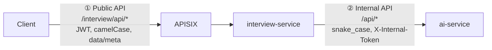

# 7. API contract

> Thuộc bộ [AI Service design doc](README.md). Liên quan: §4 (luồng xử lý), §6.4 (report), §8 (lưu trữ).

## 7.1 Hai tầng API



| | ① Public API | ② Internal API |
|---|---|---|
| Server | interview-service (NestJS) | ai-service (FastAPI) |
| Caller | Client (Next.js) qua APISIX | Chỉ interview-service, trong Docker network |
| Auth | JWT qua APISIX, role `Candidate`, chỉ chủ phiên | Header `X-Internal-Token` (env `AI_SERVICE_INTERNAL_TOKEN`) |
| Format | `{ data, meta }`, lỗi `{ statusCode, message, errorCode, details }` (`docs/conventions.md`) | JSON snake_case, lỗi `{ error, message, details }` (giữ như ai-integration.md) |
| Streaming | SSE (relay) | SSE (nguồn) |

**Bảo mật:** route APISIX `/ai/*` hiện **public, không JWT** (ai-integration.md §6). Khi ai-service gọi LLM thật,
ai cũng có thể gọi thẳng và đốt quota. Đề xuất: APISIX chỉ expose `/ai/api/health`; mọi endpoint khác chỉ gọi từ
Docker network và yêu cầu `X-Internal-Token`.

## 7.2 Public API (interview-service)

Base URL: `/interview/api`. So với `api-contracts.md` §3.4 hiện tại: `POST /sessions` **không còn trả câu hỏi
đầu** (tách sang `/start` để gắn CV trước), `/answer` chuyển sang stream. Đây là thay đổi contract với FSD.

| Method | Path | Mô tả | Response |
|---|---|---|---|
| POST | `/sessions` | Tạo phiên (track, level, thời lượng) | 201 JSON |
| POST | `/sessions/:id/cv` | Gắn CV đã nộp ở job-service (không upload) | 200 JSON |
| POST | `/sessions/:id/start` | Planner + câu hỏi đầu | **SSE** |
| POST | `/sessions/:id/answer` | Gửi câu trả lời, nhận câu hỏi tiếp | **SSE** |
| GET | `/sessions/:id` | Trạng thái, tiến độ, câu hỏi hiện tại (để resume) | 200 JSON |
| POST | `/sessions/:id/end` | Kết thúc sớm / kích hoạt tạo report | 202 JSON |
| GET | `/sessions/:id/report` | Lấy report | 200 JSON / 202 khi đang tạo |
| POST | `/sessions/:id/report/regenerate` | Tạo lại report (khi `partial` / `report_failed`) | 202 JSON |
| DELETE | `/sessions/:id` | Xóa phiên và toàn bộ dữ liệu (transcript, cv_profile, report) | 204 |
| GET | `/sessions` | Danh sách phiên của tôi (giữ như hiện tại, thêm `track`, `level`) | 200 JSON |

### POST /sessions

```http
POST /interview/api/sessions
Authorization: Bearer <JWT>
Content-Type: application/json

{ "track": "java_backend", "level": "junior", "durationMinutes": 30 }
```

```jsonc
// 201 Created
{
  "data": {
    "id": "0192f3a1-7c2e-7b10-9a55-3c1d2e4f5a6b",
    "status": "created",
    "track": "java_backend",
    "level": "junior",
    "category": "Backend",
    "difficulty": "easy",
    "durationMinutes": 30,
    "cvStatus": "none",
    "createdAt": "2026-11-10T09:00:00.000Z"
  }
}
```

Quota: tối đa 5 phiên / ứng viên / ngày (env `INTERVIEW_DAILY_QUOTA`), vượt thì 429 `QUOTA_EXCEEDED`.

### POST /sessions/:id/cv

Gắn CV **đã nộp ở job-service** vào phiên (không upload file, §2.3). Client lấy danh sách application kèm job
title từ `GET /job/api/applications/my` (đã có) để ứng viên chọn.

```http
POST /interview/api/sessions/0192f3a1-.../cv
Content-Type: application/json

{ "cvApplicationId": "0192e0aa-5b1c-7d22-8f10-aa11bb22cc33", "consent": true }
```

`cvApplicationId` bỏ trống thì dùng CV của application mới nhất. Kết quả parse được dùng lại nếu CV đã parse ở
phiên trước (cùng `objectKey + etag`), khi đó response trả gần như ngay.

```jsonc
// 200 OK — trả bản tóm tắt để ứng viên kiểm tra hệ thống hiểu đúng CV
{
  "data": {
    "cvStatus": "parsed",
    "profileSummary": {
      "headline": "Backend developer ~2 năm, Java/Spring Boot",
      "skills": ["Java", "Spring Boot", "PostgreSQL", "Kafka", "Redis"],
      "projects": [{ "id": "p1", "name": "Order service" }],
      "totalYearsExperience": 2.5,
      "trackRelevance": "high",
      "truncated": false
    }
  }
}
```

`cvStatus`: `none | parsed | failed`. Lỗi: `CV_NOT_FOUND` (404), `CV_TOO_LARGE` (413), `CV_INVALID_FORMAT` (415),
`CV_UNREADABLE` (422), `SESSION_INVALID_STATE` (409), `CV_SOURCE_UNAVAILABLE` (503). CV Parser lỗi sau retry: 200 với
`cvStatus = "failed"` (phiên vẫn chạy được).

### POST /sessions/:id/start (SSE)

```http
POST /interview/api/sessions/0192f3a1-.../start
Accept: text/event-stream
```

```text
HTTP/1.1 200 OK
Content-Type: text/event-stream
Cache-Control: no-cache
X-Accel-Buffering: no

event: meta
data: {"turnNumber":1,"phase":"intro","topicIndex":1,"topicTotal":6,"action":"ask_main","remainingSeconds":1800}

event: token
data: {"t":"Chào bạn, mình bắt đầu nhé. "}

event: token
data: {"t":"Trong CV bạn có nhắc tới order service dùng Kafka"}

event: token
data: {"t":" — bạn kể giúp mình phần việc chính của bạn trong dự án đó?"}

event: done
data: {"turnNumber":1,"question":"Chào bạn, mình bắt đầu nhé. Trong CV bạn có nhắc tới order service dùng Kafka — bạn kể giúp mình phần việc chính của bạn trong dự án đó?","sessionStatus":"in_progress","remainingSeconds":1796}
```

Planner mất vài giây trước event `meta`; interview-service gửi comment `: ping` mỗi 5 s trong lúc chờ để proxy
không cắt kết nối. Lỗi: `SESSION_INVALID_STATE` (đã start), `AI_SERVICE_ERROR`.

### POST /sessions/:id/answer (SSE)

```http
POST /interview/api/sessions/0192f3a1-.../answer
Content-Type: application/json
Accept: text/event-stream

{ "turnNumber": 4, "answer": "Em đặt @Transactional ở service layer, nếu lỗi giữa chừng thì cả hai bảng đều rollback ạ." }
```

- `turnNumber` = lượt **đang trả lời** (chống gửi trùng, §4.6). Đã xử lý → stream lại câu hỏi đã lưu ngay (1
  event `token` + `done`); đang xử lý → 409 `TURN_CONFLICT`; lệch → 409 `TURN_CONFLICT`.
- `answer`: 1–4000 ký tự sau trim (cho phép câu ngắn như "Em không biết"; contract cũ yêu cầu ≥ 10 ký tự).

```text
event: meta
data: {"turnNumber":5,"phase":"technical","topicIndex":1,"topicTotal":6,"action":"follow_up","remainingSeconds":1190}

event: token
data: {"t":"Ok, vậy nếu method đó ném ra một checked exception"}

event: token
data: {"t":" thì transaction có rollback không?"}

event: done
data: {"turnNumber":5,"question":"Ok, vậy nếu method đó ném ra một checked exception thì transaction có rollback không?","sessionStatus":"in_progress","remainingSeconds":1186}
```

Event **không chứa điểm hay nhận xét** (§6.5). `action` dùng để client hiển thị nhẹ (ví dụ nhãn "Gợi ý" khi
`hint`), có thể bỏ qua.

**Lượt cuối:** sau khi ứng viên trả lời câu wrap-up (hoặc hết giờ cứng), stream chỉ có `done`:

```text
event: done
data: {"turnNumber":15,"question":null,"sessionStatus":"reporting","remainingSeconds":0}
```

**Các event khác:**

```text
event: replace
data: {"question":"<câu hỏi dự phòng đầy đủ>"}            // Interviewer lỗi giữa stream: client thay toàn bộ câu hỏi

event: error
data: {"errorCode":"AI_SERVICE_ERROR","message":"AI tạm thời không phản hồi","retryable":true}
```

`error` với `retryable = true`: lượt chưa được ghi nhận, client cho gửi lại cùng `turnNumber`.

### GET /sessions/:id

```jsonc
// 200 OK — dùng khi refresh trang / mất kết nối giữa stream
{
  "data": {
    "id": "0192f3a1-...",
    "status": "in_progress",
    "track": "java_backend",
    "level": "junior",
    "cvStatus": "parsed",
    "progress": { "phase": "technical", "topicIndex": 1, "topicTotal": 6, "turnCount": 5, "remainingSeconds": 1150 },
    "currentQuestion": { "turnNumber": 5, "questionText": "Ok, vậy nếu method đó ném ra một checked exception thì transaction có rollback không?" },
    "turns": [
      { "turnNumber": 1, "questionText": "...", "candidateAnswer": "..." }
    ],
    "startedAt": "2026-11-10T09:01:00.000Z",
    "completedAt": null
  }
}
```

`turns` không chứa điểm khi phiên chưa `completed`.

### POST /sessions/:id/end

```jsonc
// 202 Accepted
{ "data": { "sessionStatus": "reporting" } }
```

interview-service gọi `/api/finalize` **bất đồng bộ** (promise trong process, timeout 90 s, ghi kết quả vào DB).
Khi khởi động, service quét các phiên kẹt ở `reporting` quá 5 phút và chạy lại. Không cần message queue.

### GET /sessions/:id/report

```jsonc
// 202 Accepted — đang tạo
{ "data": { "status": "reporting", "retryAfterSeconds": 3 } }
```

```jsonc
// 200 OK — report đầy đủ theo schema §6.4 (camelCase ở public API)
{
  "data": {
    "status": "complete",
    "overall": { "score": 5.7, "verdict": "near", "summary": "..." },
    "sections": [{ "phase": "intro", "score": 7.0, "weight": 0.15 }],
    "criteria": { "technicalAccuracy": 5.5, "completeness": 5.0, "extensibility": 4.5, "relevance": 8.0 },
    "topics": [], "strengths": [], "improvements": [], "studyPlan": [], "turns": [],
    "meta": { "confidence": "high", "disclaimer": "Điểm do AI chấm, mang tính tham khảo cho việc luyện tập." }
  }
}
```

### Mã lỗi

| `errorCode` | HTTP | Khi nào |
|---|---|---|
| `SESSION_NOT_FOUND` | 404 | (đã có) |
| `SESSION_NOT_YOURS` | 403 | (đã có) |
| `SESSION_COMPLETED` | 409 | (đã có) gửi answer khi phiên đã xong |
| `AI_SERVICE_ERROR` | 503 | (đã có) ai-service lỗi / timeout sau retry |
| `SESSION_INVALID_STATE` | 409 | Gắn CV sau start, start 2 lần, answer trước start |
| `TURN_CONFLICT` | 409 | `turnNumber` lệch hoặc đang xử lý |
| `CV_NOT_FOUND` | 404 | Application không tồn tại / không thuộc ứng viên / không có CV; ứng viên chưa ứng tuyển lần nào |
| `CV_SOURCE_UNAVAILABLE` | 503 | job-service hoặc object storage không phản hồi |
| `CV_TOO_LARGE` | 413 | > 10 MB hoặc > 10 trang |
| `CV_INVALID_FORMAT` | 415 | Sai magic bytes, PDF mã hóa, DOCX hỏng |
| `CV_UNREADABLE` | 422 | Trích xuất < 200 ký tự (ảnh scan) |
| `QUOTA_EXCEEDED` | 429 | Vượt số phiên / ngày |
| `VALIDATION_ERROR` | 400 | (đã có) field sai, thiếu consent, answer rỗng / > 4000 ký tự |

## 7.3 TCP pattern mới: interview-service → job-service

Theo ADR-003 (NestJS ↔ NestJS qua TCP). job-service (FSD) implement, thêm vào `api-contracts.md` §2.

```typescript
// @MessagePattern('application.getCvFile')
interface GetCvFileRequest {
  candidateId: string;           // từ x-auth-user, interview-service truyền xuống
  applicationId?: string;        // bỏ trống = application mới nhất có CV
}

interface GetCvFileResponse {
  applicationId: string;
  objectKey: string;             // key trong bucket CV
  etag: string;                  // đổi khi file đổi → dùng làm cv_file_ref cùng objectKey
  contentType: string;           // application/pdf | application/vnd.openxmlformats-officedocument.wordprocessingml.document
  size: number;                  // byte
  downloadUrl: string;           // presigned GET, TTL 5 phút
}

// Lỗi: RpcException { errorCode: 'CV_NOT_FOUND' } khi application không tồn tại,
// không thuộc candidateId, hoặc không có CV.
```

job-service **bắt buộc** kiểm `application.candidate_id = candidateId`; interview-service không tự kiểm được vì
không đọc `job_db`. Presigned URL phải ký với endpoint storage mà interview-service truy cập được (trong Docker
network là host nội bộ của MinIO; khi deploy là endpoint S3).

## 7.4 Internal API (ai-service)

Giữ tên `start / next-turn / finalize` theo constitution IV; **nội dung** đổi theo thiết kế này. Thêm `cv/parse`.

| Method | Path | Agent chạy | Response | Timeout phía interview-service |
|---|---|---|---|---|
| POST | `/api/cv/parse` | CV Parser | JSON | 30 s |
| POST | `/api/start` | Planner → Interviewer | SSE | 40 s (event đầu ≤ 25 s) |
| POST | `/api/next-turn` | Evaluator → policy → Interviewer | SSE | 45 s (event đầu ≤ 15 s) |
| POST | `/api/finalize` | (code tính điểm) → Reporter | JSON | 90 s |
| GET | `/api/health` | — | JSON | 5 s |

### POST /api/cv/parse

Multipart: `file` (bytes interview-service đã tải từ job-service), `track`. ai-service không biết CV đến từ đâu.

```jsonc
// 200 OK
{
  "cv_profile": { "schema_version": 1, "headline": "...", "skills": [], "experiences": [], "projects": [], "education": [],
                  "total_years_experience": 2.5, "track_relevance": "high",
                  "flags": { "injection_suspected": false, "truncated": false } },
  "metadata": { "model": "openai/gpt-4o-mini", "prompt_version": "cv_parser.v1", "input_tokens": 3120, "output_tokens": 640, "latency_ms": 4100 }
}
```

```jsonc
// 422
{ "error": "cv_unreadable", "message": "Extracted text shorter than 200 characters", "details": { "chars": 37 } }
```

### POST /api/start

```jsonc
{
  "session_id": "0192f3a1-...",
  "track": "java_backend",
  "level": "junior",
  "duration_minutes": 30,
  "cv_profile": { "...": "CvProfile hoặc null" }
}
```

SSE: `meta`, `token`…, `done`. Event `done` nội bộ chứa đủ dữ liệu để interview-service lưu:

```jsonc
{
  "question": "Chào bạn, mình bắt đầu nhé. ...",
  "turn": { "turn_number": 1, "phase": "intro", "topic_id": "t1", "turn_kind": "main", "action": "ask_main",
            "agent_decision": "switch_topic", "difficulty": 2, "question_source": "ai" },
  "plan": { "...": "InterviewPlan + reference_snippets" },
  "state": { "...": "candidate state §5.2" },
  "metadata": { "usage": { "planner": { "input_tokens": 2600, "output_tokens": 1400 }, "interviewer": { "input_tokens": 1200, "output_tokens": 60 } },
                "latency_ms": { "planner": 9800, "interviewer_ttft": 600, "total": 11200 },
                "prompt_versions": { "planner": "v1", "interviewer": "v1" }, "fallbacks": [] }
}
```

### POST /api/next-turn

```jsonc
{
  "session_id": "0192f3a1-...",
  "level": "junior",
  "track": "java_backend",
  "plan": { "...": "InterviewPlan đã lưu" },
  "state": { "...": "candidate state đã lưu" },
  "turn_number": 4,
  "question": "Ghi 2 bảng trong 1 method, lỗi giữa chừng thì sao?",
  "turn_kind": "main",
  "answer": "Em đặt @Transactional ở service layer, nếu lỗi giữa chừng thì cả hai bảng đều rollback ạ.",
  "topic_turns": [],
  "elapsed_seconds": 610
}
```

`topic_turns` = các lượt **trước** trong topic hiện tại (`{ "q", "a" }`, tối đa 5), interview-service lấy theo
`topic_id`. Không gửi cả transcript: Evaluator chỉ cần ngữ cảnh topic, giữ prompt nhỏ (§9).

Event `done`:

```jsonc
{
  "evaluation": {                                    // của lượt 4 vừa trả lời; null ở wrap-up
    "turn_number": 4, "answer_type": "answered", "covered_points": ["..."], "missing_points": ["..."],
    "misconceptions": [], "evidence": [], "scores": { "technical_accuracy": 3, "completeness": 2, "extensibility": 2, "relevance": 4 },
    "scores_10": { "technical_accuracy": 7.5, "completeness": 5.0, "extensibility": 5.0, "relevance": 10.0 },
    "turn_score_10": 6.5, "degraded": false
  },
  "question": "Ok, vậy nếu method đó ném ra một checked exception thì transaction có rollback không?",
  "turn": { "turn_number": 5, "phase": "technical", "topic_id": "t2", "turn_kind": "follow_up", "action": "follow_up",
            "agent_decision": "deepen", "difficulty": 3, "question_source": "ai", "reasoning": "ok + missing_points → follow_up (luật 8)" },
  "state": { "...": "candidate state mới" },
  "session_end": false,
  "metadata": { "usage": { "evaluator": { "input_tokens": 2350, "output_tokens": 290 }, "interviewer": { "input_tokens": 1500, "output_tokens": 55 } },
                "latency_ms": { "evaluator": 2100, "interviewer_ttft": 550, "total": 3600 },
                "prompt_versions": { "evaluator": "v3", "interviewer": "v2" }, "fallbacks": [] }
}
```

`reasoning` do **code** sinh từ luật policy đã khớp (không phải LLM), lưu vào `agent_reasoning` để debug.
`session_end = true` thì `question = null`.

### POST /api/finalize

```jsonc
{
  "session_id": "0192f3a1-...",
  "track": "java_backend",
  "level": "junior",
  "plan": { "...": "InterviewPlan" },
  "state": { "...": "candidate state cuối" },
  "end_reason": "plan_complete",
  "duration_s": 1790,
  "turns": [
    { "turn_number": 4, "phase": "technical", "topic_id": "t2", "turn_kind": "main", "difficulty": 3,
      "question": "...", "answer": "...", "evaluation": { "...": "Evaluation đã lưu" } }
  ]
}
```

Response 200: report theo §6.4 (snake_case) + `metadata` (usage, latency, prompt version của Reporter).

### Interface phía NestJS

`AiInterviewClient` (interview-service) đổi thành:

```typescript
export interface AiInterviewClient {
  parseCv(input: ParseCvInput): Promise<ParseCvResult>;
  start(req: AiStartRequest): AsyncIterable<AiStreamEvent>;       // meta | token | replace | done | error
  nextTurn(req: AiNextTurnRequest): AsyncIterable<AiStreamEvent>;
  finalize(req: AiFinalizeRequest): Promise<AiReport>;
}
```

`MockAiInterviewClient` giữ cho dev: `start`/`nextTurn` phát câu hỏi từ `question_bank` thành 1 event `token` +
`done`; `finalize` trả report điểm cố định.

## 7.5 Streaming qua APISIX — việc cần kiểm chứng

SSE đi qua **hai proxy hop** (interview-service relay, APISIX), mỗi hop đều có thể gom buffer làm mất hiệu
ứng stream. Chưa kiểm chứng trên repo này; cần làm ở tuần 4 (§12) trước khi FE tích hợp.

| # | Hop | Việc cần làm / kiểm tra |
|---|---|---|
| 1 | ai-service | `StreamingResponse(media_type="text/event-stream")`, header `Cache-Control: no-cache`, `X-Accel-Buffering: no`; `: ping` mỗi 5 s khi chờ LLM |
| 2 | interview-service | Ghi thẳng vào `res` (Express), `res.flushHeaders()`, đọc upstream bằng stream (không `await` cả body). **Tắt middleware `compression` cho route SSE** (compression gom buffer) |
| 3 | interview-service | Socket client đóng → không hủy upstream, đọc hết và lưu (§4.6) |
| 4 | APISIX | Kiểm tra response có bị buffer không (nginx `proxy_buffering`, header `X-Accel-Buffering`); tắt plugin nén (`gzip`/`brotli`) nếu có trên route; `timeout.read` của upstream interview ≥ 60 s |
| 5 | Client | `EventSource` chỉ hỗ trợ GET, không gửi header `Authorization` → dùng `fetch()` + `ReadableStream` + parser SSE (ví dụ thư viện `eventsource-parser`) |
| 6 | Kiểm chứng | `curl -N -X POST .../answer -H "Accept: text/event-stream" ...` qua cổng 9080: token phải hiện dần, không dồn một lần cuối |

Phương án dự phòng nếu streaming qua gateway không ổn định: `/answer` trả JSON (câu hỏi đầy đủ) như contract cũ;
UI hiển thị "đang gõ…". Đây là mục cắt giảm thứ 4 trong §12.
