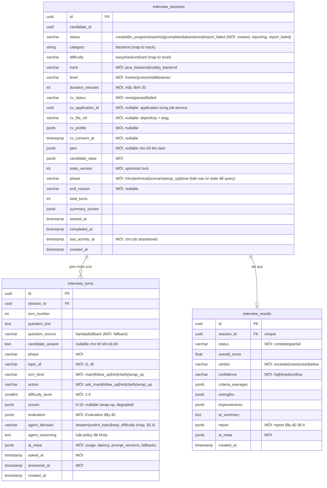

# 8. Lưu trữ dữ liệu

> Thuộc bộ [AI Service design doc](README.md). Liên quan: ADR-004, `docs/architecture/data-model.md` §3, §11 (quyền riêng tư).

## 8.1 Ai lưu gì

| Dữ liệu | Nơi lưu | Owner | Ghi chú |
|---|---|---|---|
| Session (track, level, trạng thái, thời gian) | `interview_db.interview_sessions` | interview-service | |
| `cv_profile` (đã bỏ thông tin liên hệ) | `interview_sessions.cv_profile` JSONB | interview-service | |
| **File CV gốc** | Object storage của **job-service** (bản nộp khi ứng tuyển) | job-service | interview-service **không lưu bản sao**; lấy qua presigned URL mỗi lần cần parse (§2.3) |
| Tham chiếu CV | `interview_sessions.cv_application_id`, `cv_file_ref` (`objectKey + etag`) | interview-service | Dùng lại `cv_profile` giữa các phiên cùng CV |
| Interview plan (+ `reference_snippets`) | `interview_sessions.plan` JSONB | interview-service | |
| Candidate state | `interview_sessions.candidate_state` JSONB | interview-service | Ghi đè mỗi lượt, có `state_version` |
| Transcript (câu hỏi, câu trả lời) | `interview_turns` | interview-service | 1 dòng / lượt |
| Evaluation từng lượt | `interview_turns.evaluation` JSONB + `scores` | interview-service | |
| Report | `interview_results.report` JSONB + các cột tổng hợp | interview-service | |
| Token, latency, prompt version, fallback | `interview_turns.ai_meta`, `interview_results.ai_meta` JSONB | interview-service | Cho cost tracking (S3-AIE-5) |
| Khóa phiên, quota ngày | Redis | interview-service | TTL, không phải dữ liệu bền |
| Knowledge base RAG | `ai_db.knowledge_chunks` | ai-service | Không liên quan phiên |
| Topic catalog | File trong repo (`apps/ai-service/app/catalog/*.yaml`) | **AIE + DE** | Version theo git; PR cần review của người còn lại (§8.7) |
| Prompt | File trong repo (`apps/ai-service/app/prompts/*.md`) | AIE | Version theo git |
| Dữ liệu phiên trong ai-service | **Không có** | — | Log chỉ chứa id + số đo |

## 8.2 Thay đổi schema `interview_db` (đề xuất)

Thêm cột vào 3 bảng hiện có, **không thêm bảng mới**. Migration MikroORM thuộc interview-service (FSD), cần
FSD xác nhận (README, câu hỏi 2).



Ghi chú:

- `interview_turns.next_question_hint` hiện có: bỏ (không còn dùng) hoặc để null.
- Một lượt được tạo **khi câu hỏi được hỏi** (`question_text`, `asked_at`), cập nhật khi ứng viên trả lời
  (`candidate_answer`, `answered_at`) và khi evaluation về. Như vậy `GET /sessions/:id` luôn có câu hỏi hiện tại.
- `asked_at` / `answered_at` cho phép đo thời gian trả lời (dùng cho anti-cheat S5-8 sau này).
- Index thêm: `interview_turns(session_id, topic_id)` (lấy `topic_turns`), `interview_sessions(status, last_activity_at)`
  (job abandoned / quét `reporting` kẹt), `interview_sessions(candidate_id, cv_file_ref)` (dùng lại `cv_profile`).
- `cv_application_id` chỉ là id tham chiếu, **không phải foreign key** (khác DB, constitution I).

## 8.3 Ghi dữ liệu trong một lượt

Một transaction sau khi nhận event `done` từ ai-service:

```text
BEGIN
  UPDATE interview_turns   SET evaluation, scores, ai_meta(evaluator)    WHERE turn đã trả lời
  INSERT interview_turns   (turn mới: question_text, phase, topic_id, turn_kind, action, difficulty_level, agent_decision, ...)
  UPDATE interview_sessions SET candidate_state = :new, state_version = state_version + 1, phase, total_turns, last_activity_at
                           WHERE id = :id AND state_version = :expected          -- 0 dòng → xung đột, rollback
COMMIT
```

`candidate_answer` được lưu **trước** khi gọi ai-service (không mất câu trả lời nếu ai-service lỗi).

## 8.4 Versioning dữ liệu JSONB

- Mọi JSONB do AI sinh (`cv_profile`, `plan`, `candidate_state`, `evaluation`, `report`) có `schema_version`.
- ai-service nhận `schema_version` cũ hơn hiện tại: migrate trong code (hàm `upgrade_vN_to_vN+1`); không hỗ trợ
  được thì 422. Phiên đang chạy khi deploy prompt/schema mới vẫn chạy tiếp.
- `ai_meta.prompt_versions` lưu ở từng lượt để so sánh chất lượng theo version (§10).

## 8.5 Giữ & xóa dữ liệu

| Dữ liệu | Thời gian giữ | Cách xóa |
|---|---|---|
| File CV gốc | Theo chính sách của job-service (application) | interview-service không giữ bản sao nên không phải xóa gì |
| `cv_profile`, transcript, report | Đến khi ứng viên xóa phiên hoặc xóa tài khoản | `DELETE /sessions/:id` (hard delete, cascade turns + results); xóa tài khoản → xóa mọi phiên |
| Phiên `abandoned` / `created` không start | 30 ngày | Job hằng ngày xóa hẳn |
| Redis lock / quota | TTL 60 s / 24 h | Tự hết hạn |
| Log ai-service | Theo log rotation của Docker (đề xuất 14 ngày) | — |

Thời hạn là **đề xuất**, nhóm chốt cùng chính sách quyền riêng tư (§11).

## 8.6 Log & quan sát

- ai-service log JSON mỗi lượt: `session_id`, `turn_number`, agent, model, prompt version, token in/out,
  latency, `finish_reason`, retry, fallback. **Không log** CV text, câu trả lời, câu hỏi, output LLM.
- Debug nội dung: đọc từ `interview_db` (đã có kiểm soát truy cập), không bật log nội dung ở staging/production.
  Môi trường dev có thể bật `LOG_LLM_IO=true` (mặc định `false`).
- Chi phí phiên = tổng `ai_meta.usage` × đơn giá (§9.4); cảnh báo khi phiên > $0.10 (S3-AIE-5).

## 8.7 Ảnh hưởng tới data pipeline (DE) — quyết định 2026-10-06

Kiến trúc "Evaluator chấm mỗi lượt" làm **đáp án mẫu** trở thành dữ liệu quyết định chất lượng chấm điểm
(rủi ro R2, R3 ở §11). Hạ tầng pipeline (crawl → clean → chunk → dedup → embed → index), embedding model và
idempotency **không đổi**. Thay đổi về nội dung và ưu tiên:

| Hạng mục | Quyết định |
|---|---|
| **Interview Q&A** (S1-DE-1) | Tập trung **Java BE + NodeJS BE**, 3–5 cặp cho mỗi topic trong catalog (~30 topic → 100–150 cặp) thay vì rải đều 5 category. Mỗi cặp thêm `topic_id` (id trong catalog) và `key_points` (3–6 ý). Đáp án được người thứ hai review trước khi index |
| **Cột `topic_id` trong `knowledge_chunks`** | Thêm cột `topic_id VARCHAR(80) NULL` + index `(source_type, topic_id)`. Chọn cột thật thay vì `metadata` vì: đây là bộ lọc chính khi lấy đáp án mẫu; đúng nguyên tắc của rag-design (bộ lọc thường xuyên là cột thật, như `category`, `difficulty`); dễ kiểm giá trị khi index. Q&A luôn có `topic_id`; textbook để `NULL` (một đoạn tài liệu thường liên quan nhiều topic, lọc bằng `category` + vector). Cần cập nhật rag-design §3 và migration `ai_db` trong feature 005 |
| **Retrieval lúc plan** | Mỗi topic: lấy `interview_qa` theo `topic_id` trước (khớp chính xác); dưới 2 kết quả thì bổ sung bằng vector search lọc `category` + `difficulty`, cả `interview_qa` và `textbook`. Golden query cho đánh giá RAG (S3-DE-4) viết theo dạng `title + key_points` của topic |
| **JD** (S2-DE-1..4) | Crawl + xử lý JD (S2-DE-1/2) và seed `job_db` (S2-DE-4) **giữ nguyên**. Index JD vào `ai_db` (S2-DE-3) **chuyển thành Stretch**: còn thời gian thì embed với `source_type = job_description`. MVP không có agent nào dùng JD; retriever của ai-service luôn lọc `source_type IN ('interview_qa', 'textbook')` nên có index JD hay không cũng không ảnh hưởng buổi phỏng vấn |
| **Textbook** (S3-DE-1..3) | Thêm nguồn **Java/Spring** (Spring Framework docs: transaction, data access; Java concurrency; JPA/Hibernate), giữ Node.js, PostgreSQL, System Design Primer. React hạ ưu tiên (Frontend ngoài phạm vi MVP). Chỉ tiêu chính là **độ phủ theo topic** hơn là tổng số chunk |
| **`question_bank`** (S4-DE-2) | Seed từ chính file Q&A (một nguồn duy nhất), mang theo `topic_id`; dùng làm câu hỏi dự phòng khi Interviewer lỗi (§4.6) |
| **Topic catalog** | **AIE + DE đồng sở hữu.** AIE: danh sách topic, level, `key_concepts`, scenario. DE: `resources` (link tài liệu chính thức, dùng chung danh sách nguồn với textbook để không giữ hai nơi), map Q&A ↔ topic. Pipeline đọc catalog để **từ chối** chunk có `topic_id` không tồn tại. PR sửa catalog cần review của người còn lại |
| **Dữ liệu cá nhân** | Transcript, câu trả lời, `cv_profile` và file CV **không bao giờ** được đưa vào `knowledge_chunks` hay dataset của pipeline. Nên bổ sung vào constitution V |
