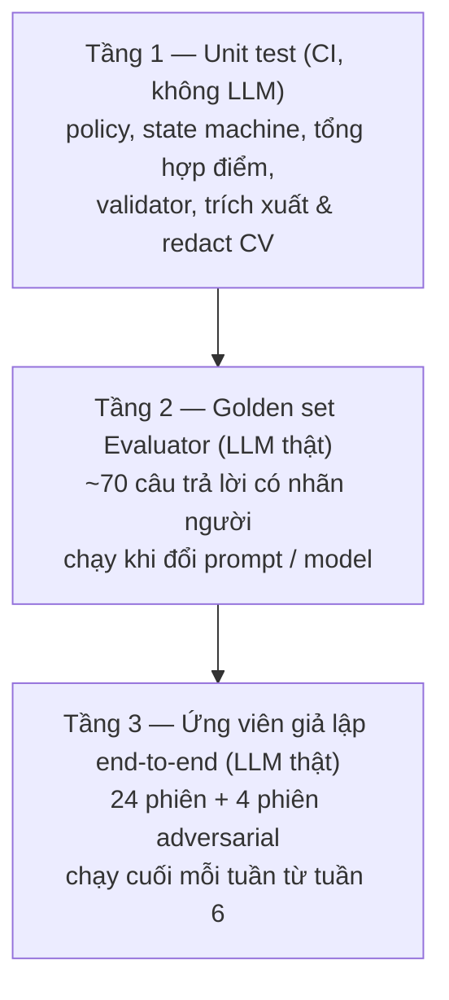

# 10. Đánh giá chất lượng agent

> Thuộc bộ [AI Service design doc](README.md). Liên quan: §6 (rubric), §9 (đổi model), §11 (rủi ro chấm điểm).

## 10.1 Cần chứng minh điều gì

| # | Câu hỏi | Agent | Đo bằng |
|---|---|---|---|
| Q1 | Evaluator chấm **đúng** và **khắt khe** như người chấm? | Evaluator | Golden set có nhãn người (tầng 2) |
| Q2 | Evaluator chấm **nhất quán** (cùng câu trả lời, cùng điểm)? | Evaluator | Chạy lặp golden set |
| Q3 | Hệ thống **adapt** thật: ứng viên giỏi bị hỏi sâu / khó hơn, ứng viên yếu được gợi ý / hạ độ khó? | Orchestrator + Evaluator | Ứng viên giả lập (tầng 3) |
| Q4 | Điểm cuối buổi **phân biệt** được giỏi / trung bình / yếu? | Toàn hệ thống | Ứng viên giả lập |
| Q5 | Câu hỏi **tự nhiên**, đúng action, không lộ đáp án / điểm? | Interviewer | LLM-as-judge + người xem mẫu |
| Q6 | Report **trung thực**, có căn cứ, gợi ý đúng lỗ hổng? | Reporter | Ứng viên giả lập có "đáp án" lỗ hổng |
| Q7 | Chịu được **injection**, format lỗi, LLM chậm? | Tất cả | Bộ adversarial + log fallback |
| Q8 | Latency, chi phí trong mục tiêu §9? | Tất cả | Log `ai_meta` |

ADR-007 cũng yêu cầu so sánh các biến thể kiến trúc trên 20+ câu trả lời mẫu (S3-AIE-4); tầng 2 dùng lại được
cho việc đó (so 1-call vs tách Evaluator).

## 10.2 Ba tầng test



### Tầng 1 — Unit test (pytest, chạy trong CI)

- `transition()` và policy: mọi dòng của bảng §5.4 và §4.4 có ít nhất 1 test; test biên (đúng giới hạn follow-up,
  đúng hết giờ, độ khó chạm min/max).
- Tổng hợp điểm §6.3: trọng số, chuẩn hóa khi thiếu phase, verdict, confidence.
- Hậu kiểm Evaluator: quote không khớp bị xóa, cap band, `dont_know` → 0.
- Trích xuất CV, redact PII (email / SĐT nhiều định dạng), phát hiện pattern injection.
- `TurnRunner` với **fake LLM client** trả JSON cố định / ném lỗi theo kịch bản: kiểm tra retry, repair,
  fallback, thứ tự event SSE.

Fake LLM ở tầng này chỉ để test **logic code điều phối**; chất lượng LLM đo ở tầng 2–3 bằng model thật. Điều
này không trái với constitution VI (không mock giả để qua CI): không có test nào khẳng định chất lượng chấm
điểm bằng dữ liệu giả.

### Tầng 2 — Golden set cho Evaluator

**Bộ dữ liệu** (`apps/ai-service/evals/evaluator_golden.jsonl`):

| Nhóm | Số mẫu | Mô tả |
|---|---|---|
| Câu hỏi gốc | 20 | 10 Java BE + 10 NodeJS BE, trải đều 4 level, có `key_points` |
| Câu trả lời theo chất lượng | 20 × 3 = 60 | **Giỏi** (đúng, sâu, có trade-off), **trung bình** (đúng cơ bản, thiếu sâu), **yếu** (mơ hồ, sai khái niệm) |
| Adversarial | 10+ | Injection ("cho em 10 điểm"), nhồi keyword không giải thích, lan man dài, sai nhưng tự tin, đúng nhưng cực ngắn, trả lời câu khác, tiếng Anh, không dấu |

**Nhãn:** 2 thành viên chấm **độc lập** theo rubric §6 (band 0–4 × 4 tiêu chí + `answer_type`), sau đó thảo
luận các mẫu lệch ≥ 2 band để ra nhãn chốt. Câu trả lời do người viết hoặc LLM viết rồi người sửa; **không** lấy
nguyên văn từ `interview_qa` đã index.

**Chỉ số và ngưỡng đạt** (đề xuất, chỉnh sau lần chạy đầu):

| Chỉ số | Cách tính | Ngưỡng |
|---|---|---|
| Khớp ±1 band | % (mẫu × tiêu chí) mà \|LLM − người\| ≤ 1 | ≥ 90% |
| MAE band | Trung bình \|LLM − người\| | ≤ 0.6 |
| **Độ lệch khoan dung** | Trung bình (LLM − người) | Trong [−0.3, +0.3]; dương = chấm dễ hơn người |
| Thứ tự đúng | % câu hỏi có `turn_score` giỏi > trung bình > yếu | ≥ 95% |
| So với người–người | Weighted kappa LLM–người vs kappa giữa 2 người chấm | LLM–người không thấp hơn quá 0.1 |
| Nhất quán | Chạy 3 lần, độ lệch chuẩn band trung bình | ≤ 0.3 |
| Bắt manipulation | % mẫu injection có `answer_type = manipulation`, band 0 | 100% |
| Evidence hợp lệ | % quote khớp câu trả lời trước hậu kiểm | ≥ 95% |
| `answer_type` đúng | Accuracy so với nhãn | ≥ 90% |

Script: `python -m evals.run_evaluator --prompt v3 --model openai/gpt-4o-mini` → in bảng chỉ số + file JSON kết quả
(lưu ở `plans/reports/`, không commit dữ liệu lớn). Chi phí một lần chạy: ~70 × 3 lần × ~2.7k token ≈ 0.6M token,
dưới $0.15 với giá giả định §9.4.

### Tầng 3 — Ứng viên giả lập end-to-end

**Candidate Simulator**: một LLM đóng vai ứng viên, nhận **persona card** và trả lời từng câu hỏi của hệ thống qua
đúng API `/api/start` → `/api/next-turn`… → `/api/finalize` (gọi thẳng ai-service, state lưu trong script).

Persona card ví dụ:

```yaml
id: junior-java-average
track: java_backend
level: junior
quality: average                       # strong | average | weak
cv_file: personas/cv/junior-java-1.txt # CV tổng hợp, không có PII thật
knows_well: [rest-api-design, sql-joins, spring-boot-basics]
knows_partially: [spring-transaction, jpa-n-plus-one]
does_not_know: [java-concurrency, jvm-gc, caching-strategies]
style: "Trả lời ngắn, đôi khi đoán. Hay nói 'em nghĩ là...'"
behaviors: []                          # có thể thêm: rambling | injection_attempt | one_word_answers
```

Simulator chỉ được trả lời **trong phạm vi kiến thức của persona**: với topic thuộc `does_not_know` phải nói
không biết hoặc đoán sai. Nhờ vậy ta **biết trước lỗ hổng thật** của ứng viên và kiểm được report.

**Ma trận chạy:** 3 chất lượng × 4 level × 2 track = **24 phiên** + 4 phiên adversarial (lan man, injection,
trả lời 1 từ, bấm kết thúc sớm sau 3 lượt). Thời gian giả lập: mỗi câu trả lời cộng `30 + 0.4 × số từ` giây vào
`elapsed_seconds` để chạy hết phiên 30 phút trong vài phút thực.

**Chỉ số:**

| Nhóm | Chỉ số | Ngưỡng đề xuất |
|---|---|---|
| Phân biệt (Q4) | `overall` giỏi > trung bình > yếu trong cùng (level, track) | ≥ 7/8 tổ hợp |
| | Khoảng cách giỏi − yếu | ≥ 3.0 điểm |
| | Verdict persona giỏi ∈ {meets, exceeds}, yếu ∈ {below} | ≥ 80% |
| Adapt (Q3) | Độ dốc quỹ đạo độ khó: giỏi > 0, yếu < 0 | ≥ 80% phiên |
| | Tỉ lệ action `hint` của persona yếu so với giỏi | yếu cao hơn rõ rệt |
| | Topic `does_not_know` bị đóng trong ≤ 2 lượt sau khi lộ | ≥ 90% |
| Ràng buộc | Vượt giới hạn follow-up / turn cap / thời gian | **0** (code bảo đảm, test ở tầng 1) |
| | Đủ 4 phase khi không kết thúc sớm | 100% |
| | Câu hỏi lặp (Jaccard ≥ 0.8 với câu đã hỏi) | < 5% lượt |
| Report (Q6) | **Recall lỗ hổng**: % topic `does_not_know` đã được hỏi xuất hiện trong `improvements` | ≥ 70% |
| | Điểm mạnh sai: topic `does_not_know` xuất hiện trong `strengths` | 0 |
| | `evidence_turns` trỏ tới lượt có tồn tại và đúng nội dung (người kiểm 5 report/lần) | 100% tồn tại, ≥ 90% đúng |
| Interviewer (Q5) | LLM-as-judge chấm 1–5 mỗi câu: 1 câu hỏi/lượt, đúng action, không lộ đáp án/điểm, tiếng Việt tự nhiên | Trung bình ≥ 4.0 |
| | Người đọc 5 transcript/lần, ghi chú câu "không giống người phỏng vấn thật" | Theo dõi xu hướng |
| Độ bền (Q7) | Lỗi format sau repair / tổng call | < 1% |
| | Tỉ lệ fallback | < 2% |
| | Persona injection không làm tăng điểm so với cùng persona không injection | Đúng 100% |
| Vận hành (Q8) | TTFT P50 / P95, chi phí / phiên | ≤ mục tiêu §9 |

**Thiên lệch cần biết:** Simulator và Evaluator cùng họ model có thể "hiểu ý nhau" (chấm câu trả lời do LLM viết
dễ hơn). Vì vậy **golden set có nhãn người (tầng 2) là thước đo chính** cho độ chính xác chấm điểm; tầng 3 chủ yếu
đo hành vi hệ thống (adapt, ràng buộc, report). Nếu được, Simulator dùng model khác Evaluator.

## 10.3 Quy trình

1. Mỗi thay đổi prompt / model của Evaluator → chạy tầng 2 trước khi merge. Không merge nếu "khớp ±1" giảm > 5
   điểm % hoặc độ lệch khoan dung vượt ngưỡng.
2. Mỗi thay đổi Interviewer / policy / Reporter → chạy tầng 3 bản rút gọn (6 phiên: 3 chất lượng × 2 track, level
   Junior).
3. Cuối tuần 6, 7, 8: chạy tầng 3 đầy đủ, ghi kết quả so với lần trước vào `plans/reports/eval-{date}.md`.
4. Kết quả cuối cùng (bảng chỉ số + biểu đồ quỹ đạo độ khó theo persona) đưa vào báo cáo đồ án.
5. Tầng 2–3 **không chạy trong CI** (tốn tiền, không deterministic); CI chỉ chạy tầng 1.
