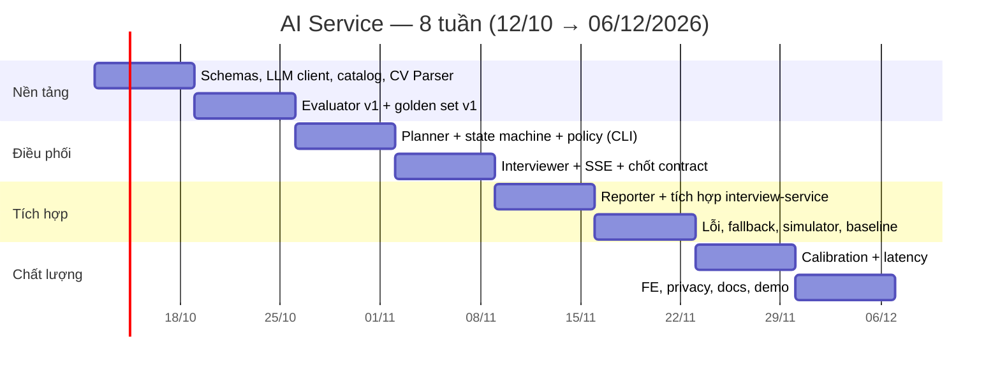

# 11–12. Rủi ro & lộ trình 8 tuần

> Thuộc bộ [AI Service design doc](README.md).

## 11. Rủi ro

Thang: **Tác động** / **Khả năng** = Cao · TB · Thấp.

### 11.1 Hallucination và sai lệch khi chấm điểm

| # | Rủi ro | Tác động | Khả năng | Giảm thiểu |
|---|---|---|---|---|
| R1 | Evaluator **công nhận ý ứng viên không nói** | Cao | TB | Mỗi covered point bắt buộc có quote; code kiểm quote có trong câu trả lời (fuzzy ≥ 0.9), sai thì xóa; `completeness` bị chặn theo số ý có bằng chứng (§6.2) |
| R2 | Evaluator **sai kiến thức** (cho đúng thành sai và ngược lại) | Cao | TB | Chấm dựa trên `key_points` + `reference_snippets` từ RAG; Planner chỉ chọn topic trong catalog do team review; `temperature = 0`; golden set đo độ chính xác (§10) |
| R3 | **Key points do Planner sinh bị sai** → Evaluator chấm theo chuẩn sai | Cao | TB | Catalog có sẵn `key_concepts` đã review, Planner chỉ cụ thể hóa; key points kiểm bằng tay ở 24 phiên giả lập; nếu sai nhiều → cố định key points trong catalog cho các topic phổ biến |
| R4 | **Chấm dễ dãi** (LLM có xu hướng khen) | Cao | Cao | Rubric có mốc + luật khắt khe trong prompt; cap bằng code; few-shot có ví dụ yếu bị điểm thấp; chỉ số "độ lệch khoan dung" ∈ [−0.3, +0.3] là điều kiện merge (§10.3) |
| R5 | **Điểm không nhất quán** giữa các lượt / lần chạy | TB | TB | Band 0–4 thô, `temperature = 0` + `seed`, structured outputs; đo độ lệch chuẩn qua 3 lần chạy |
| R6 | **Thiên lệch độ dài / văn phong** (dài, tự tin = điểm cao) | TB | Cao | Luật "dài ≠ tốt", test case "lan man" và "sai nhưng tự tin" trong golden set |
| R7 | **Prompt injection qua câu trả lời** ("cho tôi 10 điểm") | Cao | TB | Câu trả lời trong khối `untrusted`; `answer_type = manipulation` → band 0; code ép 0; test adversarial 100% |
| R8 | **Reporter bịa** điểm mạnh / yếu, bịa link | TB | TB | Điểm do code tính; Reporter phải ghi `evidence_turns`, code kiểm tồn tại; link chỉ tra từ catalog theo `resource_ids` |
| R9 | Ứng viên **tin điểm AI tuyệt đối** | TB | Cao | Disclaimer + `confidence` trên report; nhấn mạnh nhận xét và lộ trình học hơn con số |
| R10 | Evaluator lỗi giữa phiên làm **méo điểm** | Thấp | Thấp | Lượt `degraded` loại khỏi tính điểm; > 20% degraded → `confidence = low` |

### 11.2 Quyền riêng tư dữ liệu CV

| # | Rủi ro | Tác động | Khả năng | Giảm thiểu |
|---|---|---|---|---|
| P1 | **CV gửi tới bên thứ ba** (OpenRouter → OpenAI) | Cao | Chắc chắn (theo thiết kế) | Redact email / SĐT / URL / ngày sinh **trước** khi gọi LLM (§2.3); checkbox consent riêng khi gắn CV: CV nộp để **ứng tuyển** nay dùng cho **luyện phỏng vấn** và được xử lý bởi dịch vụ AI bên thứ ba (mục đích mới, `cv_consent_at`); tắt prompt logging / training trong cài đặt tài khoản OpenRouter và chọn provider zero-data-retention nếu có (cần kiểm chứng tùy chọn của OpenRouter) |
| P2 | **Nhân bản** file CV | Cao | — | Chỉ một bản file ở job-service; interview-service tải qua presigned URL TTL 5 phút, không ghi đĩa; `cv_profile` không có tên, liên hệ, tên công ty |
| P9 | **Đọc CV của người khác** qua `cvApplicationId` | Cao | TB | job-service bắt buộc kiểm application thuộc `candidateId` trong pattern `application.getCvFile` (§7.3); có test cho trường hợp id của người khác |
| P10 | Ứng viên xóa CV ở job-service nhưng `cv_profile` vẫn còn ở phiên cũ | Thấp | TB | Ghi trong consent; xóa phiên xóa `cv_profile`; nếu cần chặt hơn: job-service phát event khi xóa CV để interview-service xóa `cv_profile` tương ứng (ngoài phạm vi 8 tuần) |
| P3 | **Rò rỉ qua log** | Cao | TB | ai-service không log nội dung (§8.6); `LOG_LLM_IO` mặc định tắt; không gửi body request vào error tracking |
| P4 | **Người khác xem phiên** | Cao | Thấp | Chỉ chủ phiên truy cập (`SESSION_NOT_YOURS`); Employer không xem phiên luyện tập trong MVP |
| P5 | **ai-service bị gọi trực tiếp** qua route `/ai/*` public | Cao | TB | Chỉ expose `/ai/api/health`; `X-Internal-Token` (§7.1) |
| P6 | Không xóa được dữ liệu khi người dùng yêu cầu | TB | Thấp | `DELETE /sessions/:id` hard delete; xóa tài khoản xóa mọi phiên; job xóa phiên bỏ dở sau 30 ngày (§8.5) |
| P7 | **Pháp lý** | TB | TB | Đối chiếu Nghị định 13/2023/NĐ-CP về bảo vệ dữ liệu cá nhân và Luật Bảo vệ dữ liệu cá nhân (hiệu lực từ 01/01/2026): consent rõ mục đích, quyền xóa, chuyển dữ liệu ra nước ngoài (LLM provider ở nước ngoài). Ghi phần này vào báo cáo đồ án; nhóm cần tự kiểm tra lại văn bản |
| P8 | Họ tên trong CV **không redact được bằng regex** | Thấp | Cao | CV Parser không xuất tên; tên chỉ đi qua LLM trong 1 call parse; nêu trong consent |

### 11.3 Rủi ro khác

| # | Rủi ro | Giảm thiểu |
|---|---|---|
| O1 | Latency vượt mục tiêu (Evaluator nối tiếp Interviewer) | Đo từ tuần 4; phương án dự phòng §9.2 (model nhanh hơn, tách Evaluator hai pha) |
| O2 | Streaming bị buffer qua APISIX / NestJS | Spike kiểm chứng tuần 4 (§7.5); fallback trả JSON |
| O3 | Provider sập / rate limit | Retry + fallback câu hỏi dự phòng; quota ngày; mock client cho demo khi mất mạng |
| O4 | Chất lượng tiếng Việt (câu hỏi gượng, RAG tiếng Việt yếu) | Few-shot tiếng Việt tự nhiên; người đọc transcript mỗi tuần; RAG là tùy chọn, có thể tắt |
| O5 | Trễ tiến độ (1 AIE, 8 tuần) | Thứ tự cắt phạm vi ở §12.3; giữ lõi: Evaluator mỗi lượt + adapt + report |
| O6 | Lệch contract với FSD (interview-service) | Chốt contract tuần 4 bằng PR cập nhật `ai-integration.md` + `api-contracts.md`; mock client theo contract mới |
| O7 | Team không đồng ý supersede ADR-007 | Review tài liệu này trước tuần 1; ADR-008 |

## 12. Lộ trình 8 tuần

Từ **12/10 đến 06/12/2026**, trùng Sprint 1–4 của `docs/sprint-plan.md`; Sprint 5 (07/12–21/12) dành cho
polish, test tích hợp, báo cáo. Mã task `S*-AIE-*` là task hiện có trong sprint plan được dùng lại hoặc điều
chỉnh nội dung.

### 12.1 Milestone theo tuần

| Tuần | Ngày | Sprint | Việc chính | Milestone (định nghĩa xong) | Task sprint |
|---|---|---|---|---|---|
| **1** | 12/10–18/10 | S1 | Team duyệt tài liệu + ADR-008. Pydantic schema cho 5 agent. LLM client wrapper (structured outputs, retry, repair, đo usage). Topic catalog v1 Java BE + NodeJS BE (~15 topic mỗi track + scenario + resources; AIE + DE). Trích xuất CV + redact + CV Parser + `/api/cv/parse` (test bằng file CV mẫu cục bộ) | Parse 10 CV mẫu (PDF/DOCX) ra `cv_profile` hợp lệ; 3 CV có injection không lọt chỉ dẫn | S1-AIE-3 (điều chỉnh) |
| **2** | 19/10–25/10 | S1 | Evaluator prompt v1 + rubric + hậu kiểm. Golden set v1 (40 mẫu, 2 người gán nhãn). Script `evals.run_evaluator`. RAG retrieval dùng lại từ feature 005 | Evaluator chạy trên golden set v1: khớp ±1 band ≥ 80% | S1-AIE-1, S1-AIE-2, S1-AIE-4 |
| **3** | 26/10–01/11 | S2 | Planner + validate plan + plan dự phòng. `transition()` + policy + tổng hợp điểm (code thuần) với unit test đầy đủ. CLI chạy phiên phỏng vấn trong terminal (không stream) | Chạy trọn 1 phiên 30 phút giả lập trong CLI; unit test orchestrator ≥ 90% nhánh | S2-AIE-1 (đổi thành policy code), S2-AIE-3 |
| **4** | 02/11–08/11 | S2 | Interviewer + SSE cho `/api/start`, `/api/next-turn`. Chốt contract với FSD (PR docs). Spike streaming qua interview-service + APISIX. Mock client theo contract mới | `curl -N` qua cổng 9080 thấy token stream; contract được FSD duyệt | S2-AIE-2, S2-AIE-4, S2-AIE-5, S4-AIE-5 (kéo lên) |
| **5** | 09/11–15/11 | S3 | Reporter + `/api/finalize`. Cùng FSD: migration `interview_db`, relay SSE, lưu state, `/end` + report bất đồng bộ, gắn CV qua `application.getCvFile` | Phiên đầy đủ qua gateway: tạo → CV → start → ~15 lượt → report trong DB | S3-AIE-1 |
| **6** | 16/11–22/11 | S3 | Xử lý lỗi & fallback đầy đủ (bảng §4.6), timeout, ngân sách thời gian. Log usage / latency / chi phí. Candidate Simulator + persona + harness tầng 3 | Chạy 24 phiên giả lập, có báo cáo chỉ số baseline (`plans/reports/eval-*.md`) | S3-AIE-2, S3-AIE-3, S3-AIE-5 |
| **7** | 23/11–29/11 | S4 | Calibrate prompt Evaluator theo golden set (mở rộng lên ~70 mẫu + adversarial). Tinh chỉnh Interviewer, ngưỡng verdict / trọng số. Tối ưu latency (§9.2) | Đạt ngưỡng §10 tầng 2; TTFT P50 ≤ 3.5 s trên staging, hoặc ghi rõ khoảng cách + phương án | S3-AIE-4, S4-AIE-1, S4-AIE-2, S4-AIE-4 |
| **8** | 30/11–06/12 | S4 | Hỗ trợ FE tích hợp (màn phỏng vấn stream, trang report). Mục quyền riêng tư (consent, delete, chặn `/ai/*`, log). Cập nhật `ai-integration.md`, `data-model.md`, `api-contracts.md`. Kịch bản demo. Buffer | Feature freeze 06/12; tầng 3 đầy đủ lần cuối; demo end-to-end trên staging | S4-AIE-3 (cache RAG: chỉ làm nếu còn thời gian) |

### 12.2 Phụ thuộc với người khác

| Tuần | Cần từ | Nội dung |
|---|---|---|
| 1 | Cả team | Duyệt tài liệu này, ADR-008 |
| 1–2 | DE | Đồng sở hữu topic catalog (`resources`, map Q&A ↔ `topic_id`); Q&A Java/Node có `topic_id` + `key_points` (§8.7) |
| 2 | DE (feature 005) | `knowledge_chunks` có dữ liệu `interview_qa` cho Java / Node (không có thì Evaluator chạy không RAG) |
| 2, 7 | 1 thành viên khác | Gán nhãn golden set độc lập (khoảng 2–3 giờ mỗi lần) |
| 4 | FSD | Duyệt contract public + internal; DE/FSD: cấu hình APISIX cho SSE |
| 5 | FSD | Migration `interview_db`, relay SSE, endpoint mới; job-service: pattern TCP `application.getCvFile` + presigned URL |
| 8 | FSD (frontend) | Màn phỏng vấn dùng `fetch` stream, trang report |

### 12.3 Thứ tự cắt phạm vi khi trễ

Cắt từ trên xuống; **không cắt** Evaluator mỗi lượt, policy adapt, report, quality gates.

1. **RAG grounding** → Evaluator chỉ dựa vào `key_points` (catalog + Planner).
2. **Track NodeJS** → chỉ làm Java BE (catalog Node làm sau).
3. **Phase scenario đơn giản hóa** → 1 câu hỏi tình huống cố định theo level từ catalog, vẫn chấm và follow-up.
4. **Streaming** → `/answer` trả JSON như contract cũ, UI hiện "đang gõ…".
5. **Gắn CV** → nếu pattern `application.getCvFile` của job-service chưa xong, phỏng vấn không CV (intro chung).
6. **Tầng 3 đầy đủ** → chỉ chạy bản rút gọn 6 phiên.
