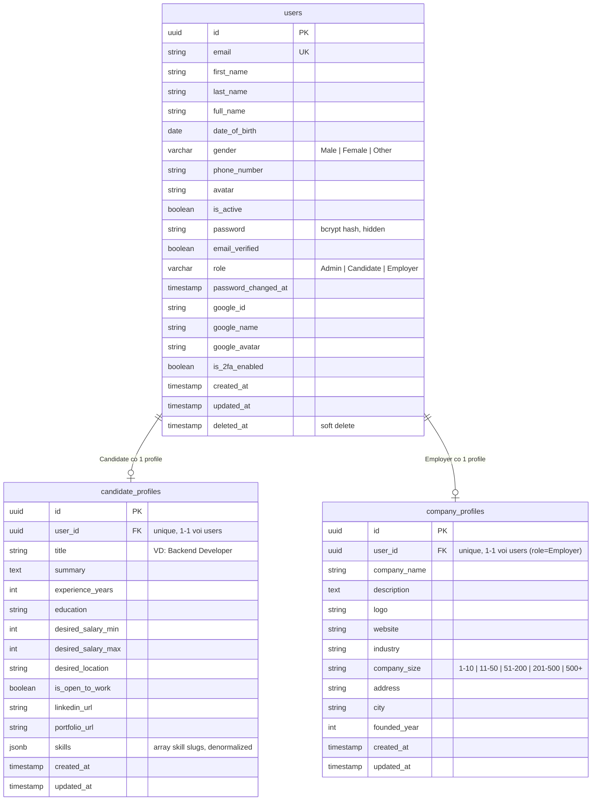
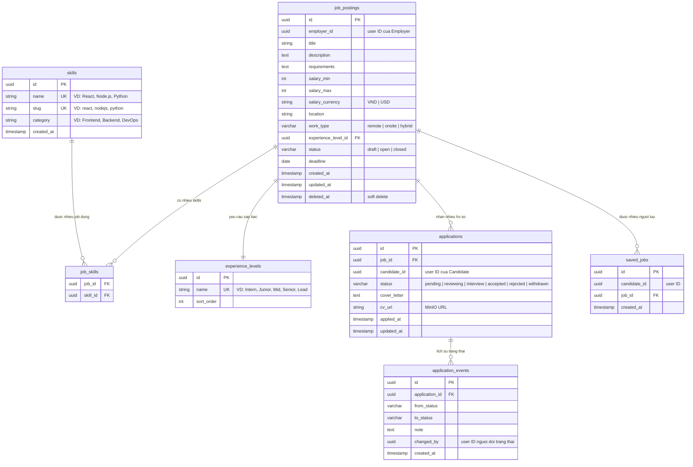
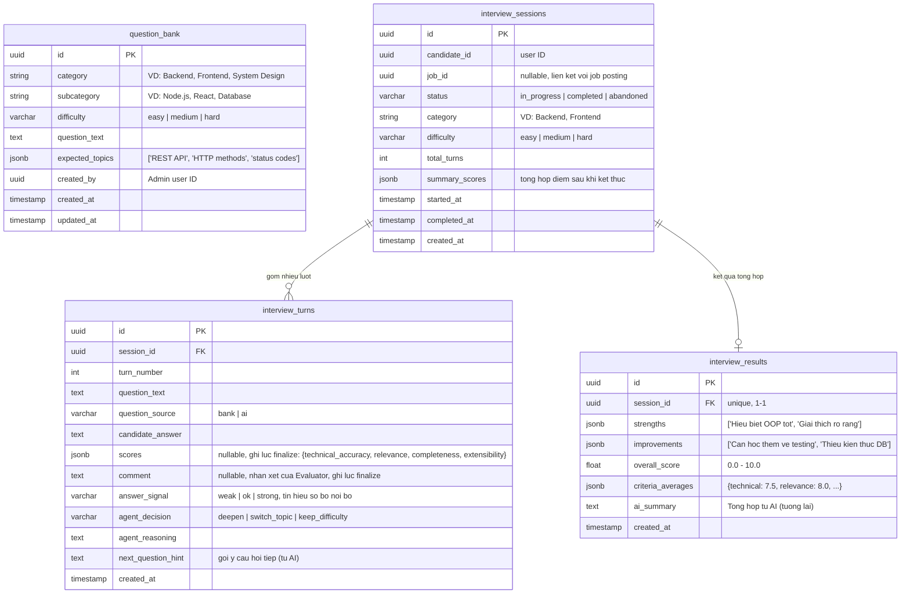
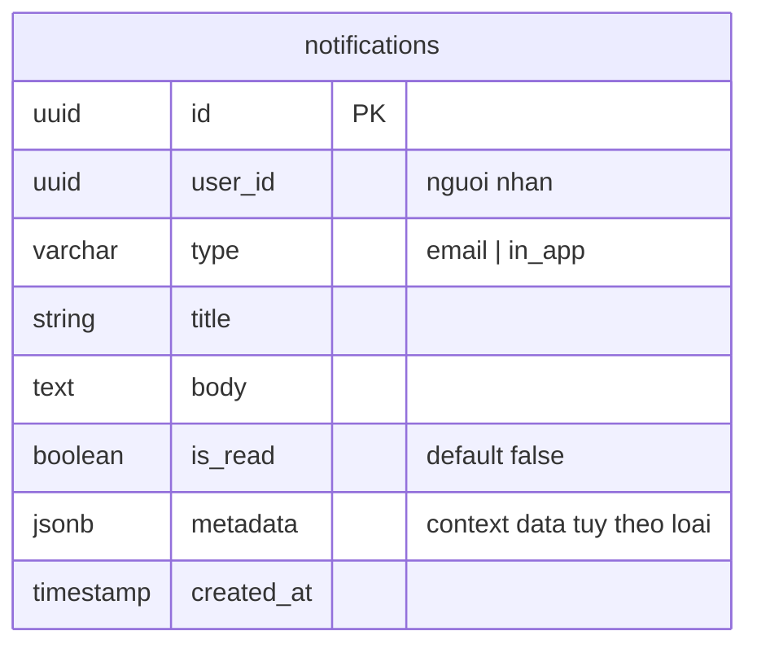
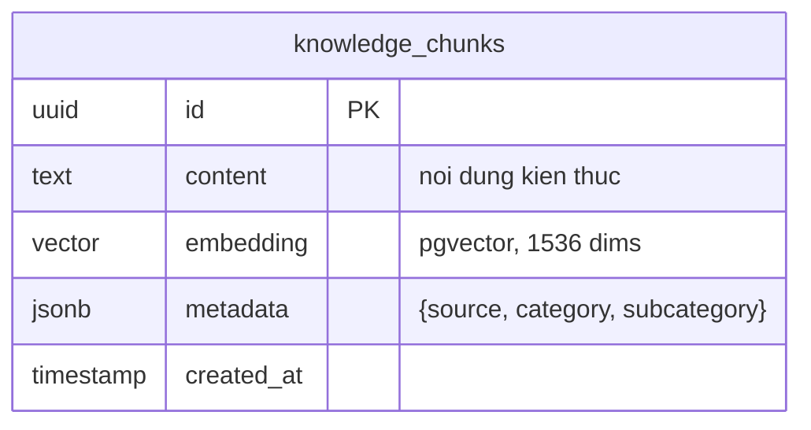

# Data Model

> ERD sơ bộ theo từng service. Mỗi service sở hữu DB riêng (xem [ADR-002](adr/adr-002-database-per-service.md)).
> **Lưu ý:** Đây là thiết kế dự kiến. Cần đối chiếu với ERD 14 bảng của nhóm (nếu có). Nếu mâu thuẫn, SRS/ERD của nhóm thắng.

## 1. user-service — `user_db`

**Ghi chú:**
- `users` đã có sẵn trong starter. Cần thêm `role` values (Candidate, Employer) và xóa các field không cần (google_id nếu không dùng Google OAuth).
- `candidate_profiles.skills` là JSONB denormalized (array slug) để hiển thị nhanh. Source of truth cho skills nằm ở `job_db.skills`.

---

## 2. job-service — `job_db`

**Ghi chú:**
- `employer_id`, `candidate_id` là user ID từ user-service. **Không có FK constraint cross-DB** — chỉ lưu UUID, validate qua TCP call.
- `cv_url` trỏ đến MinIO object. Upload qua job-service endpoint, lưu vào MinIO, trả về URL.
- `application_events` là audit trail — mỗi lần đổi status tạo 1 event.
- Index gợi ý: `job_postings(status, created_at)`, `applications(job_id, status)`, `applications(candidate_id)`, `saved_jobs(candidate_id, job_id)` UNIQUE.

---

## 3. interview-service — `interview_db`

**Ghi chú:**
- `interview_turns.scores` và `comment` **nullable**, được ghi một lần khi finalize (Evaluator chấm cuối phiên). `answer_signal` ghi mỗi lượt, chỉ dùng nội bộ. `scores` là JSONB chứa điểm theo 4 tiêu chí:
  - `technical_accuracy` (0-10): độ chính xác kỹ thuật
  - `relevance` (0-10): mức độ liên quan đến câu hỏi
  - `completeness` (0-10): độ đầy đủ câu trả lời
  - `extensibility` (0-10): khả năng mở rộng / chiều sâu
- `agent_decision` là quyết định của AI agent:
  - `deepen`: đào sâu hơn về chủ đề hiện tại
  - `switch_topic`: chuyển sang chủ đề khác
  - `keep_difficulty`: giữ nguyên độ khó
- `interview_results` chỉ tạo khi session `completed`.
- Index gợi ý: `interview_sessions(candidate_id, status)`, `interview_turns(session_id, turn_number)`.

---

## 4. notification-service — `notification_db`

**Ghi chú:**
- Table `notifications` thêm sau khi implement thông báo in-app (có thể Sprint 4-5).
- Hiện tại notification-service chỉ gửi email qua SMTP/SES, không lưu trữ.

---

## 5. ai-service — `ai_db` (tương lai)

**Ghi chú:**
- DB này **tạo từ Sprint 0** (DE init script tạo database, AIE setup pgvector extension + table).
- LLM: **OpenAI GPT-4o-mini**. Embedding: **text-embedding-3-small** (1536 dims).
- Image: `pgvector/pgvector:pg16` (thay vì postgres:16 thông thường).
- `embedding` dùng cho RAG — truy vấn semantic similarity.
- 3 nguồn: Interview Q&A (`interview_qa`), Job Descriptions crawled (`job_description`), Textbook/Tutorial (`textbook`).

---

## Tổng hợp bảng

| Service | Số bảng | Bảng chính |
|---|---|---|
| user-service | 3 | users, candidate_profiles, company_profiles |
| job-service | 6 | job_postings, skills, job_skills, applications, application_events, saved_jobs |
| interview-service | 4 | question_bank, interview_sessions, interview_turns, interview_results |
| notification-service | 1 | notifications |
| ai-service | 1 | knowledge_chunks (active từ Sprint 0) |
| **Tổng** | **15** | |

> 15 bảng, gần với ERD 14 bảng của nhóm. Chênh lệch có thể do `application_events` (audit trail) hoặc `saved_jobs`. Cần đối chiếu khi nhóm cung cấp ERD gốc.
