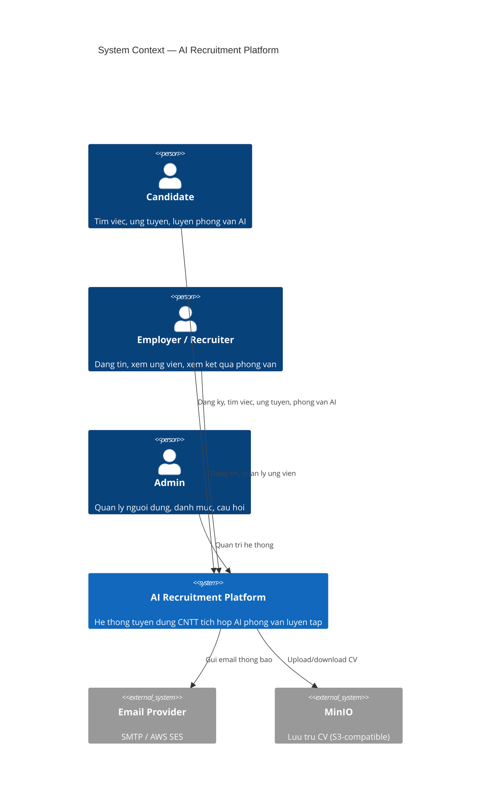
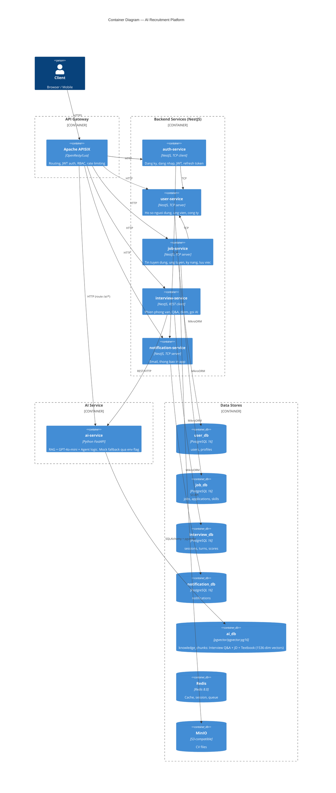

# Tổng quan kiến trúc

> Hệ thống tuyển dụng trực tuyến ngành CNTT tích hợp AI Agentic phỏng vấn.

## 1. C4 — Context Diagram



## 2. C4 — Container Diagram



## 3. Luồng request qua gateway

```
Client (Browser)
  │
  ▼
┌─────────────────────────────────────────────┐
│  Apache APISIX (port 9080)                  │
│  ┌─────────────┐  ┌──────────────────────┐  │
│  │ JWT Plugin  │→ │ serverless-post-func │  │
│  │ Verify token│  │ Inject x-auth-user   │  │
│  └─────────────┘  └──────────────────────┘  │
│  ┌──────────────────────────────────────┐   │
│  │ proxy-rewrite: /auth/* → /*         │   │
│  │                /user/* → /*         │   │
│  │                /job/*  → /*         │   │
│  │                /interview/* → /*    │   │
│  │                /ai/*   → /*         │   │
│  └──────────────────────────────────────┘   │
└───────────────────────┬─────────────────────┘
                        │ HTTP
          ┌─────────────┼─────────────┐
          ▼             ▼             ▼
   ┌────────────┐ ┌────────────┐ ┌──────────────┐
   │auth (3300) │ │user (3301) │ │job (3302)    │
   │            │ │            │ │              │
   └─────┬──────┘ └────────────┘ └──────────────┘
         │ TCP            ▲
         └────────────────┘
```

**Luồng xác thực:**
1. Client gửi request với `Authorization: Bearer <JWT>`
2. APISIX JWT plugin verify token
3. `serverless-post-function` extract payload, inject vào header `x-auth-user`
4. Service đọc `x-auth-user` header để biết user hiện tại (role, id)
5. Route public (login, sign-up, swagger) bypass JWT plugin

## 4. Luồng gọi AI service

```
Candidate bat dau phong van luyen tap
  │
  ▼
┌──────────────────────────────────────────┐
│ interview-service                        │
│                                          │
│ 1. Tao interview_session                 │
│ 2. Lay cau hoi dau tien tu question_bank │
│ 3. Tra ve cau hoi cho client             │
│                                          │
│ --- Candidate tra loi ---                │
│                                          │
│ 4. Luu candidate_answer vao turn         │
│ 5. Goi AI service (REST):               │
│    POST /api/next-turn                   │
│    Body: { question, answer, history,    │
│            context }                     │
│                                          │
│ 6. Nhan response tu AI:                  │
│    { next_question, agent_decision,      │
│      answer_signal, reasoning }          │
│                                          │
│ 7. Luu decision/signal vao turn          │
│ 8. Tao turn moi voi next_question        │
│ 9. Tra ve client (khong co diem)         │
│                                          │
│ --- Ket thuc phien ---                   │
│ 10. POST /api/finalize -> diem + nhan    │
│     xet tung cau, luu interview_results  │
└──────────────────┬───────────────────────┘
                   │ REST (HTTP)
                   ▼
┌──────────────────────────────────────────┐
│ ai-service (FastAPI)                     │
│                                          │
│ [Real AI — Sprint 2+]                    │
│  - RAG: query knowledge_chunks (pgvec)   │
│  - LLM: GPT-4o-mini danh gia tra loi    │
│  - Agent logic: deepen/switch/keep       │
│  - Sinh cau hoi tiep theo               │
│                                          │
│ [Mock fallback — env AI_SERVICE_MOCK]    │
│  - Tra ve scores co dinh                 │
│  - Random cau hoi tu question_bank       │
└──────────────────────────────────────────┘
```

## 5. Mâu thuẫn với starter repo

| Vấn đề | Starter hiện tại | Quyết định mới | ADR |
|---|---|---|---|
| Gateway | APISIX + Kong | Chỉ APISIX | [ADR-001](adr/adr-001-apisix-thay-kong.md) |
| Database | Chung 1 DB `ai-agent` | DB per service | [ADR-002](adr/adr-002-database-per-service.md) |
| Transport | gRPC (.proto) | TCP (NestJS), REST (AI) | [ADR-003](adr/adr-003-tcp-rest-transport.md) |
| Role enum | Admin, User | Admin, Candidate, Employer | Sprint 0 task |
| Package name | `nest-turbo-starter` | `@ai-recruit/*` | Sprint 0 task |
| Container prefix | `nest_turbo_*` | `ai_recruit_*` | Sprint 0 task |

## 6. Câu hỏi mở

- [ ] Nhóm có ERD 14 bảng sẵn chưa? Cần đối chiếu với data model tại [data-model.md](data-model.md)
- [ ] SRS/Use Case document của nhóm — brief nói "SRS thắng khi mâu thuẫn"
- [ ] Wireframe UI (nếu có) để tính sprint frontend chính xác hơn
