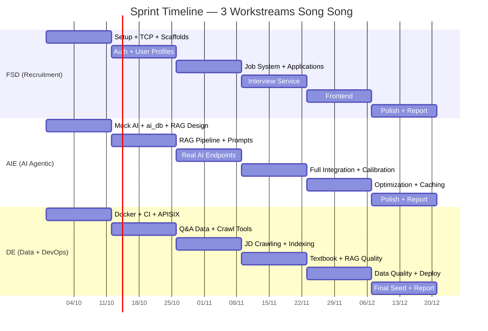

# Sprint Plan

> Team 3 người, sprint 2 tuần, bắt đầu 28/09/2026.
> Tổng cộng 6 sprint (12 tuần) → kết thúc 21/12/2026.
> **3 workstream song song:** Recruitment System | AI Agentic Interview | Data Pipeline.

## Roles & Workstreams

| Role | Thành viên | Trách nhiệm chính | Workstream |
|---|---|---|---|
| **FSD** — Fullstack Developer | ___________ | auth, user, job, interview backend, frontend | Recruitment System |
| **AIE** — AI Engineer | ___________ | ai-service (FastAPI), OpenAI GPT-4o-mini, RAG, agent logic | AI Agentic Interview |
| **DE** — Data Engineer + DevOps | ___________ | infra, data crawling/processing, RAG indexing, CI/CD | Data Pipeline |

> Overlap cho phép — help nhau khi cần, nhưng giữ primary role.

## Timeline

```
Sprint 0  28/09 ─ 12/10   Setup & Architecture
Sprint 1  12/10 ─ 26/10   Recruitment Core + AI Foundation + Data Infra
Sprint 2  26/10 ─ 09/11   Job System + RAG Pipeline + Data Crawling
Sprint 3  09/11 ─ 23/11   Interview Service + Real AI Integration + Data Indexing
Sprint 4  23/11 ─ 07/12   Frontend + AI Optimization + Data Quality
Sprint 5  07/12 ─ 21/12   Polish, Testing & Báo cáo
```

---

## Sprint 0: Setup & Architecture (28/09 → 12/10)

**Mục tiêu:** Stack chạy local, architecture chốt, mock AI có trong Docker, ai_db + pgvector sẵn sàng.

### FSD

| # | Task | AC | Bắt buộc |
|---|---|---|---|
| S0-FSD-1 | Mở rộng Role enum | Thêm `Candidate`, `Employer` vào `Role` enum. Update RBAC decorators | Bắt buộc |
| S0-FSD-2 | Chuyển gRPC → TCP | Xóa `.proto` files, đổi transport trong all services. Làm trên branch riêng | Bắt buộc |
| S0-FSD-3 | Scaffold interview-service | `apps/interview-service/` copy pattern user-service, HTTP only, trỏ interview_db | Bắt buộc |
| S0-FSD-4 | Scaffold job-service | `apps/job-service/` với TCP client cho user-service, trỏ job_db | Bắt buộc |
| S0-FSD-5 | Auth sign-up nhận role | Thêm `role` field vào `SignUpRequest` DTO | Bắt buộc |
| S0-FSD-6 | Entities + migrations | candidate_profiles, company_profiles (user_db); job-posting, skill, application (job_db) | Bắt buộc |

### AIE

| # | Task | AC | Bắt buộc |
|---|---|---|---|
| S0-AIE-1 | Setup mock ai-service | `apps/ai-service/` FastAPI, Dockerfile, health check, Docker Compose + APISIX route `/ai/*` | Bắt buộc |
| S0-AIE-2 | Setup ai_db + pgvector | Thêm `ai_db` vào init script, enable `vector` extension, tạo `knowledge_chunks` table | Bắt buộc |
| S0-AIE-3 | Research & design RAG | Chốt: embedding model (text-embedding-3-small), chunking strategy, retrieval approach | Bắt buộc |
| S0-AIE-4 | Setup dependencies | `requirements.txt`: openai, pgvector, sqlalchemy, langchain-core. Test connect GPT-4o-mini | Bắt buộc |

### DE

| # | Task | AC | Bắt buộc |
|---|---|---|---|
| S0-DE-1 | Đổi tên project | `@ai-recruit/*` packages, container prefix `ai_recruit_*`, xóa Kong | Bắt buộc |
| S0-DE-2 | Docker multi-DB | 1 PG instance, init script: `user_db`, `job_db`, `interview_db`, `notification_db`, `ai_db` | Bắt buộc |
| S0-DE-3 | MinIO | Container MinIO, env config, test upload/download | Bắt buộc |
| S0-DE-4 | APISIX routes | Routes cho `/job/*`, `/interview/*`, `/ai/*` | Bắt buộc |
| S0-DE-5 | CI pipeline | GitHub Actions: lint + check-types + test | Bắt buộc |
| S0-DE-6 | `.env.example` | Tất cả env vars: DB per service, MinIO, OpenAI key (placeholder), TCP ports | Bắt buộc |

**Demo:** `docker compose up` → tất cả services boot, routes pass, mock AI health check, ai_db có pgvector.

**Phụ thuộc:** Không.

---

## Sprint 1: Recruitment Core + AI Foundation + Data Infra (12/10 → 26/10)

**Mục tiêu:** Auth + User profile. AIE có RAG prototype. DE có data sources sẵn sàng index.

### FSD

| # | Story | AC | Bắt buộc |
|---|---|---|---|
| S1-FSD-1 | Sign-up phân biệt role | POST /api/sign-up nhận `role: Candidate \| Employer` | Bắt buộc |
| S1-FSD-2 | RBAC enforcement | `@Roles()` decorator + APISIX inject `x-auth-user`. Reject sai role | Bắt buộc |
| S1-FSD-3 | Candidate profile CRUD | title, summary, experience, skills, desired salary | Bắt buộc |
| S1-FSD-4 | Company profile CRUD | name, description, logo, industry, size | Bắt buộc |
| S1-FSD-5 | Upload avatar/logo | PUT /api/users/me/avatar → MinIO → URL | Bắt buộc |
| S1-FSD-6 | Admin user management | List, filter, activate/deactivate | Bắt buộc |
| S1-FSD-7 | Swagger + Unit tests | Coverage >= 60% auth + user | Bắt buộc |

### AIE

| # | Story | AC | Bắt buộc |
|---|---|---|---|
| S1-AIE-1 | RAG ingestion pipeline | text → chunk → embed (text-embedding-3-small) → lưu knowledge_chunks (pgvector) | Bắt buộc |
| S1-AIE-2 | RAG retrieval | query → embed → cosine similarity → top-k chunks relevant | Bắt buộc |
| S1-AIE-3 | Prompt template evaluation | system prompt + RAG context + question + answer → scores JSON + feedback | Bắt buộc |
| S1-AIE-4 | Test GPT-4o-mini end-to-end | Câu hỏi → câu trả lời mẫu → RAG retrieve → GPT-4o-mini → CriteriaScores JSON | Bắt buộc |

### DE

| # | Story | AC | Bắt buộc |
|---|---|---|---|
| S1-DE-1 | Thu thập Interview Q&A | 200+ cặp Q&A phỏng vấn CNTT (Backend, Frontend, System Design, DB, DevOps). Format JSON | Bắt buộc |
| S1-DE-2 | Setup crawling tools | Scrapy/BeautifulSoup + Playwright. Crawl được 1 source mẫu | Bắt buộc |
| S1-DE-3 | Data pipeline script | Python: load raw → clean → chunk → ready for embedding | Bắt buộc |
| S1-DE-4 | Index Q&A vào ai_db | Chạy ingestion với Q&A data. Verify search trả kết quả relevant | Bắt buộc |

**Demo:** Register/login theo role, profile CRUD. AIE: RAG tìm Q&A relevant, GPT-4o-mini cho điểm câu trả lời.

**Phụ thuộc:** Sprint 0.

---

## Sprint 2: Job System + RAG Pipeline + Data Crawling (26/10 → 09/11)

**Mục tiêu:** Job + applications hoàn chỉnh. RAG production-ready. JD data indexed.

### FSD

| # | Story | AC | Bắt buộc |
|---|---|---|---|
| S2-FSD-1 | Skills catalog (Admin CRUD) | Seed ~50 IT skills | Bắt buộc |
| S2-FSD-2 | Experience levels | Intern, Junior, Mid, Senior, Lead, Manager | Bắt buộc |
| S2-FSD-3 | Job posting CRUD | draft → open → closed, gắn skills + level | Bắt buộc |
| S2-FSD-4 | Tìm kiếm & lọc | Full-text search GIN index, filter đa tiêu chí | Bắt buộc |
| S2-FSD-5 | Ứng tuyển | Upload CV (MinIO), cover letter, check trùng | Bắt buộc |
| S2-FSD-6 | Quản lý hồ sơ | Candidate xem của mình, Employer xem theo job | Bắt buộc |
| S2-FSD-7 | Đổi trạng thái + audit | application_event log | Bắt buộc |
| S2-FSD-8 | Lưu việc làm | saved_jobs CRUD | Bắt buộc |
| S2-FSD-9 | Admin duyệt tin | approve/reject job postings | Bắt buộc |
| S2-FSD-10 | Swagger + Unit tests | Coverage >= 60% job-service | Bắt buộc |

### AIE

| # | Story | AC | Bắt buộc |
|---|---|---|---|
| S2-AIE-1 | Planner agent | Chọn `deepen` / `switch_topic` / `keep_difficulty` dựa trên `answer_signal` + history (policy code + LLM khi mơ hồ) | Bắt buộc |
| S2-AIE-2 | Interviewer agent | GPT-4o-mini sinh câu hỏi tiếp + `answer_signal` từ decision + history + RAG context | Bắt buộc |
| S2-AIE-3 | POST /api/start — real | RAG query → GPT-4o-mini sinh câu hỏi đầu tiên | Bắt buộc |
| S2-AIE-4 | POST /api/next-turn — real | Planner → Interviewer → next_question + decision + answer_signal | Bắt buộc |
| S2-AIE-5 | RealAiInterviewClient (NestJS) | HTTP client gọi ai-service, map snake_case → camelCase, retry + timeout | Bắt buộc |

### DE

| # | Story | AC | Bắt buộc |
|---|---|---|---|
| S2-DE-1 | Crawl Job Descriptions | 500+ JD từ IT job sites (topcv.vn, itviec.com). Fields: title, company, skills, description | Bắt buộc |
| S2-DE-2 | Xử lý JD data | Clean, extract skills/tech, chunk theo sections (requirements, responsibilities) | Bắt buộc |
| S2-DE-3 | Index JD vào ai_db | Embed + lưu JD chunks. Tag `source_type = 'job_description'` | Bắt buộc |
| S2-DE-4 | Seed 200 job postings | Dùng crawled JD data seed job_db | Bắt buộc |

**Demo:** Full job lifecycle. AIE: real GPT-4o-mini sinh câu hỏi tiếp (next-turn) qua ai-service.

**Phụ thuộc:** Sprint 1 (FSD: user profiles, RBAC).

---

## Sprint 3: Interview Service + Real AI Integration + Data Indexing (09/11 → 23/11)

**Mục tiêu:** Interview service kết nối real AI. Textbook data indexed. E2E hoạt động.

### FSD

| # | Story | AC | Bắt buộc |
|---|---|---|---|
| S3-FSD-1 | Question bank (Admin CRUD) | Category, subcategory, difficulty, expected_topics | Bắt buộc |
| S3-FSD-2 | DI swap Mock → Real | Đổi DI từ `MockAiInterviewClient` → `RealAiInterviewClient` qua env `AI_SERVICE_MOCK` | Bắt buộc |
| S3-FSD-3 | Bắt đầu phiên | POST /api/sessions → gọi real AI startSession, trả câu hỏi đầu | Bắt buộc |
| S3-FSD-4 | Gửi câu trả lời | POST /api/sessions/:id/answer → real AI nextTurn, lưu decision/signal, trả câu hỏi tiếp (không trả điểm) | Bắt buộc |
| S3-FSD-5 | Kết thúc phiên | Gọi AI finalize, lưu scores + comment từng turn, tạo interview_results. Timeout dài, FE có trạng thái chờ | Bắt buộc |
| S3-FSD-6 | Lịch sử phiên | Candidate xem lại. Employer xem kết quả ứng viên (tín hiệu tham khảo) | Bắt buộc |
| S3-FSD-7 | Swagger + Unit tests | Coverage >= 60% interview-service | Bắt buộc |

### AIE

| # | Story | AC | Bắt buộc |
|---|---|---|---|
| S3-AIE-1 | Full agentic E2E | Session 5 lượt: startSession → 5x nextTurn → finalize (Evaluator chấm từng câu + nhận xét) → interview_results | Bắt buộc |
| S3-AIE-2 | Context window management | Trim history để giữ trong token limit. Giữ N turns gần nhất + summary | Bắt buộc |
| S3-AIE-3 | Error handling + fallback | OpenAI timeout → fallback mock response. Retry 3x exponential backoff | Bắt buộc |
| S3-AIE-4 | Evaluator calibration + so sánh kiến trúc | Prompts Evaluator cho scores consistent. Test 20+ câu trả lời mẫu; so sánh 1-call vs 1-agent vs 3-agent (điểm, latency, cost) | Bắt buộc |
| S3-AIE-5 | Cost tracking | Log token usage per session. Alert nếu session > $0.10 | Stretch |

### DE

| # | Story | AC | Bắt buộc |
|---|---|---|---|
| S3-DE-1 | Thu thập Textbook/Tutorial | 10+ nguồn: Node.js docs, React docs, PostgreSQL docs, CS fundamentals, System Design | Bắt buộc |
| S3-DE-2 | Xử lý textbook | Chunk theo chapter/section, metadata: source, topic, difficulty_hint | Bắt buộc |
| S3-DE-3 | Index textbook vào ai_db | ~5000+ chunks. Coverage: Backend, Frontend, DB, System Design | Bắt buộc |
| S3-DE-4 | RAG quality evaluation | Test queries, đánh giá relevance. Điều chỉnh chunk_size nếu cần | Bắt buộc |
| S3-DE-5 | Dedup | Loại bỏ chunks trùng nội dung trước index | Bắt buộc |

**Demo:** Phỏng vấn với AI thật — câu hỏi từ RAG, đánh giá GPT-4o-mini, agent quyết định hướng tiếp theo.

**Phụ thuộc:** FSD cần Sprint 2; AIE cần S2-AIE-4; DE chạy song song.

---

## Sprint 4: Frontend + AI Optimization + Data Quality (23/11 → 07/12)

**Mục tiêu:** Frontend hoàn chỉnh. AI production-ready. Data đủ chất lượng demo.

### FSD

| # | Story | AC | Bắt buộc |
|---|---|---|---|
| S4-FSD-1 | Next.js setup | `apps/web` TypeScript, Tailwind CSS, shadcn/ui, TanStack Query | Bắt buộc |
| S4-FSD-2 | Auth pages | Login, Register (chọn role), JWT httpOnly cookie | Bắt buộc |
| S4-FSD-3 | Layout & Navigation | Header, nav responsive, sidebar Employer/Admin | Bắt buộc |
| S4-FSD-4 | Job listing + detail | Search, filter, pagination, nút ứng tuyển/lưu | Bắt buộc |
| S4-FSD-5 | Apply flow | Upload CV, cover letter, xem trạng thái | Bắt buộc |
| S4-FSD-6 | Employer dashboard | Quản lý tin, xem ứng viên, đổi trạng thái | Bắt buộc |
| S4-FSD-7 | Profile pages | Candidate + Company, edit forms | Bắt buộc |
| S4-FSD-8 | Interview practice UI | Bắt đầu phiên, câu hỏi, form trả lời, scores real-time, lịch sử | Bắt buộc |
| S4-FSD-9 | Admin pages | Quản lý users, duyệt tin, skills, câu hỏi | Stretch |

### AIE

| # | Story | AC | Bắt buộc |
|---|---|---|---|
| S4-AIE-1 | Prompt refinement | Cải thiện prompts từ test sessions. Scores realistic | Bắt buộc |
| S4-AIE-2 | Category-specific RAG | Prompts khác nhau Backend/Frontend/System Design, RAG filter theo category | Bắt buộc |
| S4-AIE-3 | Response caching | Cache RAG results trong Redis (TTL 1h) | Bắt buộc |
| S4-AIE-4 | Performance | P95 latency < 3s cho next-turn endpoint | Bắt buộc |
| S4-AIE-5 | Streaming responses | Server-Sent Events cho typing effect | Stretch |

### DE

| # | Story | AC | Bắt buộc |
|---|---|---|---|
| S4-DE-1 | Data quality review | Review sample chunks, loại bỏ noise/off-topic | Bắt buộc |
| S4-DE-2 | Seed data hoàn chỉnh | 200+ job postings, 50+ companies, 100+ candidates, question bank | Bắt buộc |
| S4-DE-3 | Deploy staging | Docker Compose trên VPS/cloud, HTTPS | Bắt buộc |
| S4-DE-4 | Monitoring | Logs, metrics, uptime check | Stretch |

**Demo:** Luồng đầy đủ browser: Register → Job → Apply → Interview AI thật → kết quả.

**Phụ thuộc:** FSD Sprint 1-3; AIE Sprint 3; DE Sprint 3.

---

## Sprint 5: Polish, Testing & Báo cáo (07/12 → 21/12)

**Mục tiêu:** Hệ thống ổn định, dữ liệu demo, báo cáo sẵn sàng.

| # | Story | AC | Assign | Bắt buộc |
|---|---|---|---|---|
| S5-1 | Integration tests | E2E: auth → job → apply → interview với real AI | Team | Bắt buộc |
| S5-2 | Bug fixes | Fix tất cả bugs từ Sprint 4 | Team | Bắt buộc |
| S5-3 | Performance | DB indexes, query optimization. API < 500ms. AI next-turn < 3s | FSD + AIE | Bắt buộc |
| S5-4 | Security review | OWASP Top 10, API keys không expose, auth bypass | FSD | Bắt buộc |
| S5-5 | Báo cáo tốt nghiệp | Kiến trúc, AI integration, RAG pipeline, kết quả, kết luận | Team | Bắt buộc |
| S5-6 | Slides thuyết trình | Demo flow rõ, nhấn mạnh AI + RAG feature | Team | Bắt buộc |
| S5-7 | Notification enhancement | In-app: ứng tuyển, đổi trạng thái, kết quả phỏng vấn | FSD | Stretch |
| S5-8 | Anti-cheat cơ bản | Log thời gian trả lời, phát hiện copy-paste | AIE | Stretch |

---

## Mốc cắt giảm phạm vi (nếu chậm)

### Mức 1: Cut Stretch goals
Bỏ: streaming, cost tracking, monitoring, admin pages, anti-cheat, notification enhancement.

### Mức 2: Đơn giản hóa AI
Fallback về mock AI nếu RAG/OpenAI không ổn định đủ cho demo.

### Mức 3: Đơn giản hóa Frontend
Chỉ Candidate + Employer flow. Bỏ Admin. Desktop only.

### Mức 4: Bỏ Frontend, demo API
Swagger UI + Postman. Vẫn có đủ backend + real AI.

---

## Dependency Timeline


