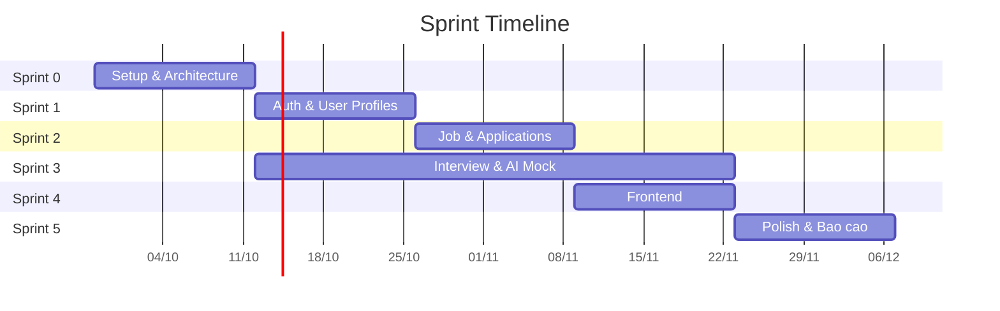

# Sprint Plan

> Team 3 người, sprint 2 tuần, bắt đầu 28/09/2026.
> Tổng cộng 6 sprint (12 tuần) → kết thúc 21/12/2026.
> Để trống tên người — nhóm tự điền.

## Timeline

```
Sprint 0  28/09 ─ 12/10   Setup & Architecture
Sprint 1  12/10 ─ 26/10   Auth & User Profiles
Sprint 2  26/10 ─ 09/11   Job Management & Applications
Sprint 3  09/11 ─ 23/11   Interview Service & AI Mock
Sprint 4  23/11 ─ 07/12   Frontend & Integration
Sprint 5  07/12 ─ 21/12   Polish, Testing, Bao cao
```

## Phân công gợi ý (vertical slice)

| Người | Trách nhiệm chính | Lý do |
|---|---|---|
| A: ___________ | auth-service, interview-service | Auth là nền tảng, interview là feature độc lập |
| B: ___________ | user-service, job-service | User → Job là luồng chính recruitment |
| C: ___________ | Infrastructure, AI mock, frontend setup | Docker, APISIX, CI, mock FastAPI, Next.js bootstrap |

> Chia theo vertical slice để giảm blocking. Mỗi người own 1-2 service từ đầu đến cuối (DB → API → test).

---

## Sprint 0: Setup & Architecture (28/09 → 12/10)

**Mục tiêu:** Stack chạy được local, kiến trúc chốt, conventions chốt, mock ai-service có trong Docker.

### Stories

| # | Story | AC (Acceptance Criteria) | Assign | Bắt buộc |
|---|---|---|---|---|
| S0-1 | Đổi tên project scope | `package.json` name → `@ai-recruit/*`, container prefix → `ai_recruit_*`, network name | C | Bắt buộc |
| S0-2 | Xóa Kong, giữ APISIX | Xóa `docker-compose-kong.yml`, `config/kong/`. APISIX là gateway duy nhất | C | Bắt buộc |
| S0-3 | DB per service | Docker init script tạo `user_db`, `job_db`, `interview_db`, `notification_db`. Mỗi service có `mikro-orm.config.ts` riêng | C | Bắt buộc |
| S0-4 | Chuyển gRPC sang TCP | Xóa `.proto` files, đổi transport trong `main.ts` và `app.module.ts`, update `MicroserviceModule` | A | Bắt buộc |
| S0-5 | Mở rộng Role enum | Thêm `Candidate`, `Employer` vào `Role` enum. Update RBAC decorators | A | Bắt buộc |
| S0-6 | Tạo skeleton job-service | Scaffold `apps/job-service` (copy pattern từ user-service), config, Dockerfile, APISIX route | B | Bắt buộc |
| S0-7 | Tạo skeleton interview-service | Scaffold `apps/interview-service`, config, Dockerfile, APISIX route | A | Bắt buộc |
| S0-8 | Mock ai-service (FastAPI) | `apps/ai-service/` với `main.py`, Dockerfile, health check. Route qua APISIX `/ai/*` | C | Bắt buộc |
| S0-9 | MinIO trong Docker Compose | Thêm MinIO container, config env vars, test upload/download | C | Bắt buộc |
| S0-10 | CI cơ bản | GitHub Actions: lint + check-types + test cho mỗi push/PR | C | Bắt buộc |
| S0-11 | `.env.example` cập nhật | Thêm tất cả env vars mới (DB per service, MinIO, AI service, TCP ports) | C | Bắt buộc |
| S0-12 | Chốt conventions & architecture docs | Review docs, merge vào main | Team | Bắt buộc |

**Demo:** `docker compose up -d` → tất cả services boot, APISIX route tới mỗi service, health check pass, mock AI trả về response.

**Rủi ro:**
- gRPC → TCP migration có thể break existing auth/user flow. **Mitigation:** làm trên branch riêng, test kỹ trước merge.
- Docker Compose phức tạp hơn với nhiều DB. **Mitigation:** dùng 1 PG instance với init script tạo nhiều database.

**Phụ thuộc:** Không (sprint đầu tiên).

---

## Sprint 1: Auth & User Profiles (12/10 → 26/10)

**Mục tiêu:** Người dùng đăng ký/đăng nhập theo role, quản lý hồ sơ.

### Stories

| # | Story | AC | Assign | Bắt buộc |
|---|---|---|---|---|
| S1-1 | Sign-up phân biệt role | POST /api/sign-up nhận thêm `role: Candidate \| Employer`. Tạo user với role tương ứng | A | Bắt buộc |
| S1-2 | RBAC enforcement | Decorator `@Roles(Role.Candidate)` hoạt động. APISIX truyền role qua `x-auth-user`. Service reject nếu sai role | A | Bắt buộc |
| S1-3 | Candidate profile CRUD | Candidate tạo/xem/sửa profile (title, summary, experience, skills, desired salary) | B | Bắt buộc |
| S1-4 | Company profile CRUD | Employer tạo/xem/sửa profile công ty (name, description, logo, industry, size) | B | Bắt buộc |
| S1-5 | Upload avatar | PUT /api/users/me/avatar → lưu lên MinIO, trả về URL | B | Bắt buộc |
| S1-6 | Admin user management | GET /api/users (list, filter), PATCH /api/users/:id/status (active/deactivate) | A | Bắt buộc |
| S1-7 | Swagger cho auth + user | Swagger docs đầy đủ, test được từ UI | A, B | Bắt buộc |
| S1-8 | Unit tests auth + user | Coverage >= 60% cho auth-service và user-service | A, B | Bắt buộc |

**Demo:** Đăng ký Candidate + Employer, login, xem/sửa profile, upload avatar, Admin xem danh sách user.

**Rủi ro:**
- Role migration có thể ảnh hưởng users cũ. **Mitigation:** migration thêm role column với default = 'Candidate'.

**Phụ thuộc:** Sprint 0 hoàn tất (TCP transport, Role enum, MinIO).

---

## Sprint 2: Job Management & Applications (26/10 → 09/11)

**Mục tiêu:** Employer đăng tin, Candidate tìm việc và ứng tuyển.

### Stories

| # | Story | AC | Assign | Bắt buộc |
|---|---|---|---|---|
| S2-1 | Skills catalog (Admin CRUD) | POST/GET/PUT/DELETE /api/skills. Seed ~50 IT skills (React, Node.js, Python, Docker...) | B | Bắt buộc |
| S2-2 | Experience levels catalog | Seed: Intern, Junior, Mid, Senior, Lead, Manager. GET /api/experience-levels | B | Bắt buộc |
| S2-3 | Job posting CRUD (Employer) | POST/PUT/PATCH /api/jobs. Trạng thái: draft → open → closed. Gắn skills, experience level | B | Bắt buộc |
| S2-4 | Tìm kiếm & lọc job | GET /api/jobs?keyword=&skill=&level=&location=&workType=&salaryMin=&page=&limit=. Full-text search trên title + description | B | Bắt buộc |
| S2-5 | Ứng tuyển (Candidate) | POST /api/applications — attach CV (upload MinIO), cover letter. Check không ứng tuyển trùng | B | Bắt buộc |
| S2-6 | Xem hồ sơ ứng tuyển | Candidate: GET /api/applications/my. Employer: GET /api/applications/job/:id | B | Bắt buộc |
| S2-7 | Đổi trạng thái hồ sơ | PATCH /api/applications/:id/status (Employer). Tạo application_event audit trail | B | Bắt buộc |
| S2-8 | Lưu việc làm | POST/DELETE /api/saved-jobs/:jobId. GET /api/saved-jobs (Candidate) | B | Bắt buộc |
| S2-9 | Admin duyệt/gỡ tin | PATCH /api/jobs/:id/admin-status (Admin). Duyệt hoặc gỡ tin vi phạm | A | Bắt buộc |
| S2-10 | Swagger cho job-service | Đầy đủ tất cả endpoints | B | Bắt buộc |
| S2-11 | Unit tests job-service | Coverage >= 60% | B | Bắt buộc |
| S2-12 | Seed data 200 tin tuyển dụng | Script seed ~200-300 IT job postings với skills, locations, salary ranges thực tế | C | Bắt buộc |

**Demo:** Employer đăng tin → Candidate tìm kiếm + lọc → Ứng tuyển với CV → Employer xem ứng viên + đổi trạng thái.

**Rủi ro:**
- Full-text search PostgreSQL có thể chậm nếu không có index. **Mitigation:** dùng `tsvector` + GIN index trên title + description.
- CV upload size limit. **Mitigation:** set max 10MB, validate file type (pdf, docx).

**Phụ thuộc:** Sprint 1 (user profiles, RBAC).

---

## Sprint 3: Interview Service & AI Mock (09/11 → 23/11)

**Mục tiêu:** Candidate luyện phỏng vấn với AI mock, Employer xem kết quả.

### Stories

| # | Story | AC | Assign | Bắt buộc |
|---|---|---|---|---|
| S3-1 | Question bank (Admin CRUD) | POST/GET/PUT/DELETE /api/question-bank. Category, subcategory, difficulty, expected_topics | A | Bắt buộc |
| S3-2 | Seed bộ câu hỏi | ~100 câu hỏi phỏng vấn CNTT chia theo category (Backend, Frontend, System Design, Database, DevOps) và difficulty | C | Bắt buộc |
| S3-3 | AiInterviewClient interface | Interface + MockAiInterviewClient dùng question_bank. DI token để swap sau | A | Bắt buộc |
| S3-4 | Bắt đầu phiên phỏng vấn | POST /api/sessions → tạo session, gọi mock AI startSession, trả về câu hỏi đầu tiên | A | Bắt buộc |
| S3-5 | Gửi câu trả lời | POST /api/sessions/:id/answer → lưu answer, gọi mock AI evaluateAnswer, lưu scores + agent_decision, trả về câu hỏi tiếp | A | Bắt buộc |
| S3-6 | Kết thúc phiên | POST /api/sessions/:id/end → tính tổng hợp scores, tạo interview_results | A | Bắt buộc |
| S3-7 | Lịch sử phiên (Candidate) | GET /api/sessions, GET /api/sessions/:id (chi tiết + turns + scores) | A | Bắt buộc |
| S3-8 | Employer xem kết quả | GET /api/sessions/candidate/:id — xem kết quả phỏng vấn của ứng viên như **tín hiệu tham khảo** | A | Bắt buộc |
| S3-9 | Swagger + Unit tests | Đầy đủ, coverage >= 60% | A | Bắt buộc |
| S3-10 | E2E test: luồng phỏng vấn | Bắt đầu → trả lời 5 câu → kết thúc → xem kết quả | A | Stretch |

**Demo:** Candidate bắt đầu phỏng vấn → trả lời 5 lượt → xem điểm theo tiêu chí → Employer xem kết quả ứng viên.

**Rủi ro:**
- Mock AI scores không thực tế, nhưng đủ cho demo flow. **Mitigation:** random trong khoảng hợp lý (5-9/10), thêm variance.

**Phụ thuộc:** Sprint 0 (interview-service skeleton, mock ai-service).

---

## Sprint 4: Frontend & Integration (23/11 → 07/12)

**Mục tiêu:** Frontend cơ bản kết nối tất cả API. Hệ thống chạy end-to-end.

### Stories

| # | Story | AC | Assign | Bắt buộc |
|---|---|---|---|---|
| S4-1 | Next.js project setup | `apps/web` với TypeScript, Tailwind CSS, project structure, env config | C | Bắt buộc |
| S4-2 | Auth pages | Login, Register (chọn role), Forgot password. JWT lưu trong httpOnly cookie hoặc localStorage | C | Bắt buộc |
| S4-3 | Layout & Navigation | Header (logo, nav, user menu), Sidebar (cho Employer/Admin), Footer. Responsive | C | Bắt buộc |
| S4-4 | Job listing page | Danh sách tin, search bar, filter (skill, level, location, work type, salary), pagination | C | Bắt buộc |
| S4-5 | Job detail page | Thông tin đầy đủ, nút "Ứng tuyển", nút "Lưu việc", thông tin công ty | C | Bắt buộc |
| S4-6 | Apply modal/page | Form ứng tuyển: upload CV, cover letter. Hiển thị trạng thái ứng tuyển | C | Bắt buộc |
| S4-7 | Employer dashboard | Danh sách tin của tôi, xem ứng viên, đổi trạng thái hồ sơ | B | Bắt buộc |
| S4-8 | Profile pages | Candidate profile, Company profile. Edit forms | B | Bắt buộc |
| S4-9 | Interview practice page | Bắt đầu phiên, hiển thị câu hỏi, form trả lời, hiển thị scores, lịch sử | A | Bắt buộc |
| S4-10 | Admin pages | Quản lý users, duyệt tin, quản lý skills, quản lý câu hỏi | A | Stretch |
| S4-11 | Notification UI | Dropdown thông báo (nếu notification-service đã enhance) | C | Stretch |

**Demo:** Luồng đầy đủ trên browser: Register → Login → Tìm việc → Ứng tuyển → Employer xem ứng viên → Candidate phỏng vấn AI → Xem kết quả.

**Rủi ro:**
- Frontend cho 3-person team trong 2 tuần là tight. **Mitigation:** dùng UI library (shadcn/ui hoặc Ant Design) để tiết kiệm thời gian. Ưu tiên golden path, bỏ qua edge cases UI.
- CORS issues giữa Next.js dev server và APISIX. **Mitigation:** APISIX CORS plugin đã config sẵn.

**Phụ thuộc:** Sprint 1-3 (tất cả backend APIs).

---

## Sprint 5: Polish, Testing & Báo cáo (07/12 → 21/12)

**Mục tiêu:** Hệ thống ổn định, dữ liệu demo, báo cáo tốt nghiệp.

### Stories

| # | Story | AC | Assign | Bắt buộc |
|---|---|---|---|---|
| S5-1 | Integration tests | Test các luồng chính end-to-end (auth → job → apply → interview) | Team | Bắt buộc |
| S5-2 | Seed data hoàn chỉnh | 200-300 IT job postings, 50+ companies, 100+ candidates, bộ câu hỏi phỏng vấn | C | Bắt buộc |
| S5-3 | Bug fixes | Fix tất cả bugs được phát hiện từ Sprint 4 | Team | Bắt buộc |
| S5-4 | Performance tối thiểu | DB indexes, query optimization, response time < 500ms cho các API chính | B | Bắt buộc |
| S5-5 | Security review | Check OWASP Top 10: SQL injection, XSS, CSRF, auth bypass. Scan dependencies | A | Bắt buộc |
| S5-6 | Báo cáo tốt nghiệp | Viết báo cáo theo template trường (kiến trúc, thiết kế, kết quả, kết luận) | Team | Bắt buộc |
| S5-7 | Slides thuyết trình | Chuẩn bị slides demo | Team | Bắt buộc |
| S5-8 | Real AI integration | Kết nối ai-service thật (FastAPI + LLM API + RAG). Đổi `MockAiInterviewClient` → `RealAiInterviewClient` | A | Stretch |
| S5-9 | Notification enhancement | In-app notifications: ứng tuyển thành công, đổi trạng thái, kết quả phỏng vấn | C | Stretch |
| S5-10 | Anti-cheat cơ bản | Log thời gian trả lời, phát hiện copy-paste | A | Stretch |
| S5-11 | Deploy staging | Docker Compose trên VPS/cloud để demo | C | Stretch |

**Demo:** Hệ thống hoàn chỉnh với dữ liệu thực tế, chạy ổn định, sẵn sàng demo trước hội đồng.

**Rủi ro:**
- Báo cáo mất nhiều thời gian. **Mitigation:** viết parallel với code từ Sprint 3-4, không để đợi đến Sprint 5.
- Real AI integration có thể không kịp. **Mitigation:** Mock vẫn hoạt động, demo được flow. AI thật là bonus.

---

## Mốc cắt giảm phạm vi (nếu chậm tiến độ)

### Mức 1: Cut Stretch goals (mất 0 feature core)

Xóa tất cả item "Stretch": Admin pages, notification UI, real AI integration, anti-cheat, deploy staging.

### Mức 2: Đơn giản hóa Frontend (mất 20% UX)

- Chỉ làm Candidate flow + Employer flow. Bỏ Admin pages hoàn toàn.
- Dùng UI tối giản, không animation, không responsive (desktop only).

### Mức 3: Bỏ Frontend, chỉ demo API (mất 50% demo)

- Demo bằng Swagger UI + Postman collection.
- Vẫn có đầy đủ backend + AI mock.

### Mức 4: Bỏ Interview Service (mất 30% feature)

- Chỉ còn recruitment core: auth → profile → job → apply.
- Không có AI phỏng vấn.
- **Chỉ dùng khi rất gấp** — đồ án mất điểm vì thiếu AI feature.

---

## Tổng hợp dependency



> **Ghi chú:** Sprint 3 (Interview) có thể bắt đầu song song với Sprint 1-2 vì interview-service độc lập với job-service. Người A có thể làm interview từ Sprint 1 sau khi xong auth stories.
